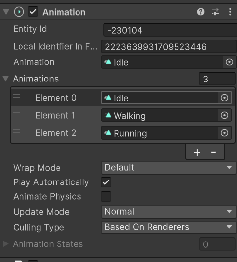
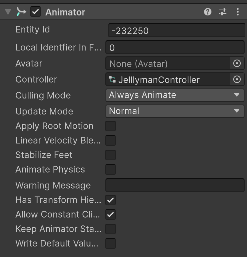
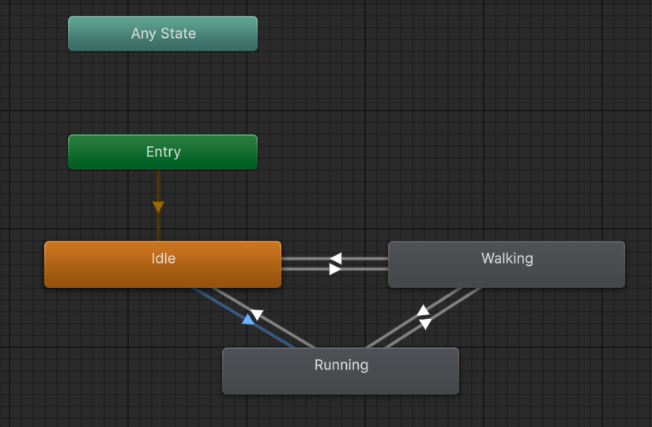
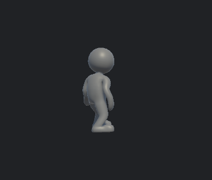
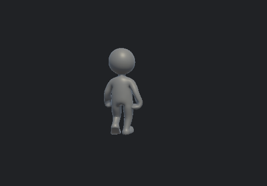
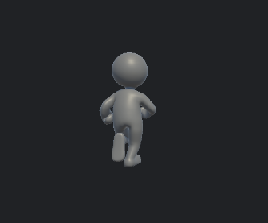

# 애니메이션(Animation)과 FSM - 3D

## ⭐ FSM(유한 상태 머신)

### ✅ 개념

1. 객체가 한 번에 하나의 상태만 가질 수 있도록 제어하는 모델.
2. 각 시스템 별 상태들 관계를 관리 및 전이하는 디자인 패턴 일종으로 상태 패턴과 가깝다.

### ✅ 특징

1. 상태 변화에 따른 여러 동작을 구현해야 될 때 많이 사용.
2. Animation Controller을 생성하여 상태변화에 따른 애니메이션을 유동적(상황에 맞게 처리)으로 관리.
3. 하나 또는 여러 개의 parameter를 사용하여 오브젝트의 상태 및 움직임을 표현.

### ✅ 구조

    ```
    현재 상태(State) + 조건(Parameter) -> 상태 전이(Transition)
    ```

1. Idle <-> Walking
2. Walking <-> Running

### ✅ 구성 요소

1. 상태: 이동 중, 체력 고갈 상태, 달리기 중 -> 객체가 현재 어떤 상태인지 나타냄.
2. 조건: 이동, 달리기, 공격 등의 행동을 하기 위한 조건 -> 상태를 변경하기 위한 판단 기준.
3. 상태 전이: 전환 조건이 충족 시 다른 상태로 진입.


## ⭐ Unity 애니메이션(Animation) 구성 요소

### 🎯 애니메이션(Animation)

#### ✅ 개념

1. 단일의 애니메이션을 적용하기 위한 컴포넌트

#### ✅ 특징

1. 게임 오브젝트에 직접 붙여서 사용.
2. 구버전 애니메이션 구현 방식으로 옛날 방식의 게임을 만들고자 할 떄나 단발성 연출에 쓰임.
3. 거의 유니티 구버전에서만 사용.
4. 코드 짜기가 Animator에 비해 어렵고 전이 조건도 직접 코드를 짜야해서 관리하기 어려움.
5. 예외(오류) 처리가 어려움.
6. 애니메이션 클립(Animation Clip)를 코드로 호출해서 구현하는 방식.
7. 애니메이션 클립(Animation Clip)은 시간에 따라 값이 변하는 데이터를 저장하며 legacy형태여만 애니메이션 구현이 가능.
8. .anim 파일

#### ✅ 컴포넌트



### 🎯 애니메이터(Animator)

#### ✅ 개념

1. 애니메이션 컨트롤러를 객체에 적용하기 위한 컴포넌트
2. 여러 개의 애니메이션을 관리하는 시스템

#### ✅ 특징

1. Parameter로 조건을 간단하게 코드 작성하여 쉽게 구현 가능.
2. FSM의 기능을 수행하며 FSM 구조로 구성.
3. FSM기능인 Animator Controller을 생성해 오브젝트의 동작, 상태 등을 구현하여 관리 
4. 관리하기 편하고 Animation 보다 관리하기 쉽다.
5. 유니티 최신 버전에서 많이 사용.
6. .controller 파일

#### ✅ 컴포넌트



#### ✅ 애니메이터(Animator) 구조: State

1. Idle, Walking, Running 등의 각 상태를 나타내는 단위
2. 노드(데이터나 기능을 담고 있는 하나 단위).

#### ✅ 애니메이터(Animator) 구조: Transition

1. 상태 전이 표시, 화살표
2. 상태(State)와 상태(State)를 잇는 통로
3. Entry: 게임 시작 시 처음 에니매이션 작동 조건
4. Make Transition: 화살표를 생성하여 각 상태에 전이



### 🎯 Animation Clip(녹화본)

#### ✅ 개념

1. Animation과 Animator가 둘 다 사용하는 것
2. 객체의 움직임을 미리 정의한(저장한) 파일

## ⭐ Skinned Mesh Renderer 컴포넌트

### ✅ 개념

1. 뼈의 움직임에 따라 변형되는 메시(mesh)를 화면에 그리는 컴포넌트
2. 그래픽 디자이너가 Blender 작업 할 때 오브젝트에 뼈대 작업(Riging)하여 생동감 있게 구현한 것으로 유니티에 나타는 컴포넌트


## ⭐ Animation 테스트 1: 

1. 컴포넌트 설정

    a. 오브젝트에 Animation 컴포넌트 적용
    b. 오브젝트 컴포넌트 Debug롤 설정 후 asset으로 받은 각 상태 Animation Clip들을 legacy 형태로 변경


2. 코드

    ```csharp
    using UnityEngine;

    public class Animation_Test : MonoBehaviour
    {
        Animation _anim;

        private void Awake()
        {
            // 애니메이션 컴포넌트를 가져옴
            _anim = GetComponent<Animation>();
        }

        private void Update()
        {
            if(Input.GetKeyDown(KeyCode.Alpha1))
            {
                // bool 타입의 Play는 string을 매개변수로 포함
                _anim.Play("Idle");
            }
            else if(Input.GetKeyDown(KeyCode.Alpha2))
            {
                _anim.Play("Walking");
            }
            else if(Input.GetKeyDown(KeyCode.Alpha3))
            {
                _anim.Play("Running");
            }
        }
    }
    ```

** Play()는 재생 성공 여부를 bool 값으로 반환하며 string 타입의 상태(State) Animation Clip 이름을 매개변수로 받으며, 해당 이름이 Animation 컴포넌트에 등록된 Animation Clip 이름과 일치해야 재생한다.

2. 결과
    
    a. 오브젝트가 각 상태가 실행되게 설정한 키를 눌렀을 때 동작

    

    

    

## ⭐

## 참고자료

- FSM

    1. https://shin17blog.tistory.com/21
    2. https://seoksii.tistory.com/56
    3. https://dodobug.tistory.com/16
    4. https://tearsinrain.tistory.com/10
    5. https://gamecoke.tistory.com/entry/Unity-FSM-%EC%9C%A0%ED%95%9C-%EC%83%81%ED%83%9C-%EB%A8%B8%EC%8B%A0
    6. https://velog.io/@xoaud321/%EC%9C%A0%EB%8B%88%ED%8B%B0-%EB%94%94%EC%9E%90%EC%9D%B8-%ED%8C%A8%ED%84%B4-FSM-%ED%8C%A8%ED%84%B4-%EA%B5%AC%ED%98%84


https://russellstudio.tistory.com/137

https://spaceunderthe.tistory.com/59

https://devshovelinglife.tistory.com/488

https://artiper.tistory.com/359

https://www.ibatstudio.com/%EC%9C%A0%EB%8B%88%ED%8B%B0-%EC%95%A0%EB%8B%88%EB%A9%94%EC%9D%B4%EC%85%98-vs-%EC%95%A0%EB%8B%88%EB%A9%94%EC%9D%B4%ED%84%B0-%EB%91%90-%EC%BB%B4%ED%8F%AC%EB%84%8C%ED%8A%B8%EC%9D%98-%EC%B0%A8%EC%9D%B4/

