# coroutine

## 개념
1. Unity 라이프사이클 안에서 작업을 여러 프레임에 나누어 순차적으로 실행할 수 있게 해주는 기능.
2. 비동기처럼 여러 개로 실행되는 것처럼 보이지만 실제로는 메인 스레드에서 동기적(순차적)으로 실행되는 작업.

## 특징 
1. retunr이 아닌 return yield null 키워드를 활용하여 대기 프레임 제어합니다.
2. 불필요한 반복의 기능 호출 등을 일지 중지, 재개를 하여 효율적으로 제어합니다.
3. 다수의 프레임에 분산하여 처리하는 동기식 작업.
4. 코루틴은 라이프 사이클 별개로 유니티에서 따로 관리.

## 라이프 사이클과 코루틴 작동 순서(크게)
Awake() -> OnEnable() -> Start() -> FixedUpdate() -> OnTrigger() -> OnCollision() -> yield WaitForFixedUpdate(){코루틴, WaitForFixedUpdate에서 다시 FixedUpdate()} -> Update() -> yield null(코루티) -> yield WaitForSeconds(){코루티} -> yield WWW

## 코루틴 사용 시 주의점
1. 불필요한 메모리 반복/누적 발생이 일어나고 메모리 단편화가 이뤄져서 가비 컬렉션 대상이 많아져 과부하가 일어나 컴퓨터 끊김 같은게 일어납니다. 이는 캐싱을 통해 억지하여 누수 방지해야 합니다. 대표적으로 yield return delay;를 쓰거나 메서드 호출 제어(StopCoroutine)를 통해 방지합니다.

** 가비지 컬렉션: 불필요한 메모리를 찾아 청소.
** 메모리 단편화: 메모리가 충분한데 쓸데 없이 메모리들이 흩어져 있어서 한 메모리에 할당하지 못한 상황으로. 할당은 메모리 공간 확보를 뜻합니다.

## 캐싱
1. 코루틴이 자동으로 멈추지 않으므로 StopCoroutine 메서드를 통해 멈춰줘야 합니다.
2. StartCoroutine()을 여러 번 호출하면 같은 코루틴이 여러 개 실행될 수 있으므로 bool문을 통해 제어합니다.
3. yield return null;을 자주 사용하면 매 프레임마다 실행하여 불필요한 호출이 많아져 성능저하가 일어나므로 WaitForSeconds() 또는 WaitForEndOfFrame()을 사용해 실행 빈도를 조절합니다.
4. while(true) 루프를 사용하면 무한 루프가 발생할 수 있으므로 yield return을 항상 포함시키고 특정 조건에서 break;를 사용합니다.
5. 코루틴 실행되는 도중에 게임 오브젝트가 삭제되면 this가 null이 되어 예외(오류)가 발생되므로 this == null 또는 gameObject == null로 체크 후 종류 해줍니다.

## IEnumerable
1. 컬렉션(데이터)들을 상속시켜 열거하여 관리
2. IEnumerator가 실행되기 위해 데이터를 제공하는 데이터 보관소
2. 대표적으로 List<T>, Array. foreach 문을 씁니다.

## IEnumerator
1. 코루틴이나 지연된 실행을 지원하는 인터페이스로 지금 몇 번째까지 읽었는지(State)를 기억하는 장치
2. 코루틴에서 제공하는 yield 키워드를 사용해 코루틴의 실행을 일시 중지하거나 특정 조건이 만족될 때까지 대기
3. 컬렉션에서 반복을 돕는 기능, IEnumerable에 상속되어 있는 컬렉션을 가져와 순차적으로 순회하는 역할을 해줍니다.
4. Current: 현재 데이터를 반환 
5. MoveNext(): 컬렉션의 다음 요소를 가르킴. 다음 요소가 없었으면 false, 다음요소가 있으면 true를 반환.

4. 대표적인 키워드

    ```
    yield return null: 다음 Update() 가 실행될때까지 대기 후 실행

    yield return new WaitForSeconds(): 주어진 시간이 지난 후 다시 실행.

    yield return Coroutine(): 다른 코루틴이 완료될 때까지 대기.

    yield return new WaitForEndOfFrame(): yield return null;이 종료될 때 호출
    yield break(): 코루틴은 끝냄
    ```

** 컬렉션(Collection): 여러 개의 데이터를 저장하고 관리하는 자료구조

## IEnumerable, IEnumerator 관계
1. Collection -> IEnumerable -> GetEnumerator() -> IEnumerator -> MoveNext() -> Current
2. Collection -> IEnumerable -> foreach() -> IEnmerator -> -> MoveNext() -> return fals: foreach 종료, return true: Current 실행 후 반복할 코드 수행

## 유니티 코루틴 yield return과 stopcoroutine 차이
1. yield return: 코루틴을 잠시 멈추고 나중에 이어서 실행
2. stopcoroutine: 코루틴을 완전히 종료

## visual studio에서 IEnumerable, IEnumerator를 사용하기 위한 조건
1. using System.Collections;를 써야 사용가능

## Thread, 동기, 비동기

- Thread
1. 일을 처리하는 공간(동기, 비동기가 이 공간에서 작업을 합니다.)
2. 싱글 스레드 - 동기: 하나의 공간에서 순서대로 처리
3. 싱글 스레드 - 비동기: 하나의 공간에서 순서 상관없이 처리
4. 멀티 스레드 - 동기: 여러 개의 공간에서 순서대로 처리, 처리해야하는 다른 작업이 있더라고 먼저 처리중인 작업이 완료되기 전까지 다른 공간을 활용할 수 없다.
5. 멀티 스레드 - 비동기: 여러 개의 공간에서 순서에 상관없이 일 처리, 처리해야 할 작업이 많을 때 효율적이다.

- 동기
1. 순차적으로 일처리.
2. 코드를 구현하기가 쉽고 실행 순서를 빠르게 파악할 수있습니다.
3. 하나의 함수에만 실행 및 처리 때문에 효율적이지 못할 수 있습니다.

- 비동기식
1. 순서와 상관 없이 일처리.
2. 구현이 복잡.
3. 무한 루프, 무한 대기 상태에 빠지는 경우도 있다.

## Coroutine와 Thread  차이

### - Coroutine 개념
1. 비동기처럼 여러 개로 실행되는 것처럼 보이지만 실제로는 메인 스레드에서 동기적(순차적)으로 실행되는 작업.

### - Coroutine 특징
1. 매 프레임에서 IEnumerator의 반복기 형태로 호출
2. 단일 쓰레드로 매 프레임 마다 흐른 시간을 체크하며 프레임 마다 조건이 충족하는지 확인 후 충족 시 코루틴 호출
3. Update()문의 실행과 별개로 어떤 동작만 어떤 시간동안 따로 동작하고 싶을 때 사용.
4. Update()로만 여러 기능을 호출하게 되면 프레임 드랍(FPS가 순각적으로 떨어져 끊기는 현상)이 일어나지만 캐싱을 사용한 코루틴을 통해 여러 프레임을 나눠서 사용하면 보완 할수 있습니다.
5. 
6. 단점:
    ``` 
    -> 오브젝트가 비활성화 되면 코루틴 정지
    -> 가비지 컬렉션 대상들이 많아져 과부하가 발생하고 프레임이 낮아지며 끊기는 현상이 발생.
    ```

. 동작 순서: 

    Update() -> yield null -> yield WaitForSeconds -> yield WWW -> yield StartCoroutine


### - Coroutine 코드 테스트

1. 참고 자료 그대로 적용

2. 코드

```csharp
using UnityEngine;
using System.Collections.Generic;
using System.Collections;

public class Coroutine_Test : MonoBehaviour
{
    private void Start()
    {
        StartCoroutine(HelloWorld(2f));
        StartCoroutine(HelloWorld(1f));      
        StartCoroutine(HelloWorld(3f));
    }

    private IEnumerator HelloWorld(float seconds)
    {
        yield return new WaitForSeconds(seconds);
        Debug.Log("Hello World");
    }
}
```
3. 결과: 1초 마다 코루틴이 디버그 호출


### - Thread 개념
1. 일을 처리하는 공간으로 이 공간 안에서 동기와 비동기 작업처리가 이뤄집니다.

### - Thread 특징
1. process(작업의 단위) 안에 들어 있는 일처리 공간 또는 흐름의 단위.
2. Thread(작업대) 안에서 동기 또는 비동기로 작업을 합니다. 

## - Thread_async(비동기)와 Coroutine 차이

- 반환값 처리
    ```
    1. Coroutine: 반환값을 직접 받을 수 없어서 다른 변수나 콜백(다른 함수에 의해 호출되는 함수)으로 처리해야 합니다.
    2. Thread_async: 직접 반환 가능
    ```

- 예외처리
    ```
    1. Coroutine: try-catch를 사용 못하므로 예외처리(게임 실행 중 오류를 잡기위한 처리방식) 불가능.
    2. Thread_async: try-catch를 사용 할 수 있어서 정상적으로 예외처리가 가능합니다.
    ```

- Unity 엔진과의 통합
    ```
    1. Coroutine: Time.timeScale 영향을 받으며 timeScale(Unity안에서의 시간)이 0이면 멈춤.
    2. Thread_async: Time.timeScale 영향을 안받고 Task(실제 시간) 기반으로 작동.
    ```

- 취소와 제어
    ```
    1. Coroutine: 취소 및 제어과 쉽습니다.
    2. Thread_async: 취소를 할려면 CancellationToken과 같은 함수가 필요
    ```

- 주요 사용법
    ```
    1. Coroutine: Unity의 물리, 프레임, 애니메션 작업과 프레임 기반 로직 등에 적합
    2. Thread_async: 데이터 처리, 네트워크 작업, 예외 처리, 반환 값 필요시, 등에 적합
    ```

** 콜백: 다른 함수가 완료된 후 호출되는 함수.

### Thread 코드 테스트

1. 참고자료에 람다식을 썼는데 람다식이 편하고 좋지만 현업에서 쓰기엔 부적합하다고 들어서 람다식 말고 클래스 멤버 함수로 썼습니다. -> 참고 자료 활용

2. 코드
```csharp
using UnityEngine;
using System.Threading;

public class ThreadTest : MonoBehaviour
{
    private void Start()
    {
        Thread thread1 = new Thread(Thread1);
        Thread thread2 = new Thread(Thread2);
        Thread thread3 = new Thread(Thread3);

        thread1.Start();
        thread2.Start();
        thread3.Start();
    }

    private void Thread1()
    {
        HelloWorld(2f);
    }

    private void Thread2()
    {
        HelloWorld(1f);
    }

    private void Thread3()
    {
        HelloWorld(3f);
    }

    private void HelloWorld(float seconds)
    {
        Thread.Sleep((int)(1000 * seconds));
        Debug.Log("Hello, World!");
    }
}
```

3. 결과: 코루틴과 비슷하게 디버그 호출


### 람다식(=>)

1. 장점:
    ```
    -> 간결성
    -> 간단한 로직을 즉시 실행
    -> 익명 함수로 별도의 메서드를 정의하지 않고 함수를 사용할 수 있습니다.
    ```

2. 단점:
    ```
    -> 가독성 저하
    -> 디버깅 어려움
    -> 익명 함수로 동일한 로직을 여러 곳에 사용해야 할 경우 코드 중복이 발생하여 재사용이 불가능합니다.
    ```

## 코루틴 실습 1: 라이프 사이클을 통한 코루틴 테스트

```csharp
using System.Collections;
using UnityEngine;

public class CoroutineTest : MonoBehaviour
{
    // 코루틴 시작지점
    private void Start()
    {
        StartCoroutine(TestCoroutine());
        Debug.Log("Start"); 
    }

    private void FixedUpdate()
    {
        Debug.Log("FixedUpdate");
    }

    private void Update()
    {
        Debug.Log("Update");
    }

    private void LateUpdate()
    {
        Debug.Log("LateUpdate");
    }

    // 일시정지를 위해 yield return null을 사용하여 다음 프레임까지 대기
    private IEnumerator TestCoroutine()
    {
        PrintColorLog("Start Coroutine");

        // 코루틴 시작 후 다음 프레임까지 일시정지
        yield return null;
        PrintColorLog("yield return null");

        // 1초 동안 일시정지
        yield return new WaitForSeconds(1.0f);
        PrintColorLog("wait for Seconds 1sec");

        // FixedUpdate가 호출될 때까지 일시정지
        yield return new WaitForFixedUpdate();
        PrintColorLog("wait for FixedUpdate");

        // 하나의 프레임이 출력될 떄까지 여러 라이프 사이클 동작
        yield return new WaitForEndOfFrame();
        PrintColorLog("wait for End of Frame");

        // 코루틴 마침
        PrintColorLog("End Coroutine ");
        yield break;
    }

    private void PrintColorLog(string text)
    {
        Debug.Log($"<color=yellow>{text}</color>");
    }
}
```

- 결과

1. 1초 후 Update() 프레임 호출 다음에 코루틴 로그, 마지막으로 LateUpdate() 호출 후 코루틴 종료

    ```
    Start 코루틴 -> Start() -> FixedUpdate() -> Update() -> LateUpdate() -> FixedUpdate() -> Update() -> yield return null -> LateUpdate() -> FixedUpdate() -> Wait For FixedUpdate -> Update() -> LateUpdate() -> Wait For End OF Frame -> End Coroutine
    ```

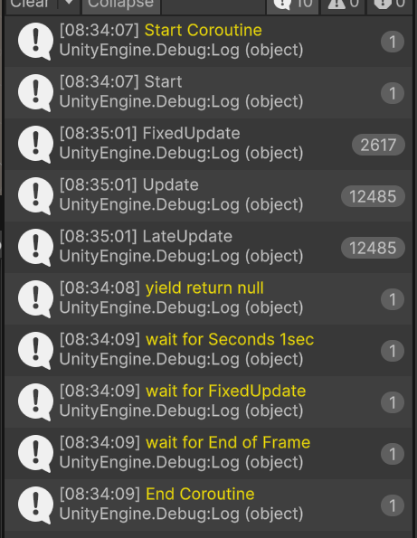

## 코루틴 실습 2: 코루틴 중복 시 문제점

```csharp
using System.Collections;
using UnityEngine;

public class CubeController : MonoBehaviour
{
    private void Update()
    {
        if(Input.GetMouseButtonDown(0))
        {
            StartCoroutine(CubeCoroutine());
        }
        if(Input.GetMouseButtonDown(1))
        {
            StopCoroutine("CubeCoroutine");
        }
    }

    private IEnumerator CubeCoroutine()
    {
        while(true)
        {
            Debug.Log("coroutine");
            yield return new WaitForSeconds(1.0f);
        }
    }
}
```

- 결과
1. 코루틴이 클래스로 이뤄진 객체이고 코루틴 인스턴스가 메모리에 할당되어 있기 때문에 한 번 더 코루틴 실행 시 중첩됩니다. yield return에 사용했던 WaitForSeconds는 객체의 인스턴스가 할당되는 것이기 때문에 가비지컬렉션 대상이 계속해서 쌓일 수 있습니다.

2. 코루틴 한번 실행 시 1초 마다 디버그가 호출되지만 한 번더 코루틴 실행을 하면 1초 마다 코루틴이 두 번 중첩되어서 호출됩니다.

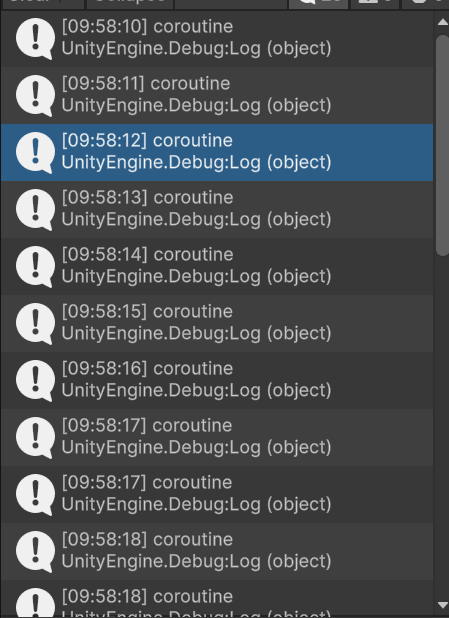

** 가비지 컬렉션: 더 이상 사용하지 않는 객체의 메모리를 자동으로 회수하는 기능

## 코루틴 실습 3: 코루틴 중복 문제점 보완

### 코루틴 캐싱 개념
1. 가비지 컬렉션 대상이 계속 쌓이는 것을 방지

### 코루틴 캐싱 특징

1. 메모리 단편화 방지: 

    공간이 충분한 메모리가 있는데 쓸데 없이 메모리가 조각나 흩어져서 공간 확보를 제대로 못하고 가비지 컬렉션이 빈번히 일어나 프레임이 자주 끊겨 게임에서 자주 끊김이 발생하지만 캐싱을 하여 이를 방지합니다.

    ```
    yield return delay;  // deley가 끝날 떄까지 현재 코루틴을 중단하고 조건이 만족 시 다시 실행
    ```

2. 메서드 호출 제어:

    IEnumerator 인스턴스의 정보를 저장함으로써 코루틴의 중복 실행을 막거나, StopCoroutine()으로 중단하기 위한 용도로 Routine()이 호출될 때마다 새로운 IEnumerator 인스턴스가 생성되기 때문에 메모리 단편화 방지 다르다.

```csharp
using UnityEngine;
using System.Collections;
using System;

public class CubeController_complement : MonoBehaviour
{
    [SerializeField] private float _coroutineDelay;

    private Coroutine _coroutine;
    private WaitForSeconds _delay;

    private void Awake()
    {
        Init();
    }

    private void Init()
    {
        _delay = new WaitForSeconds(_coroutineDelay);
        _coroutine = null;
    }

    private void Update()
    {
        if(Input.GetKeyDown(KeyCode.Q))
        {
            if(_coroutine == null)
            {
                _coroutine = StartCoroutine(CubeCoroutine());
            }
        }

        // null이 아닌 경우 코루틴을 중지
        if(Input.GetKeyDown(KeyCode.W))
        {
            if(_coroutine != null)
            {
              StopCoroutine(_coroutine);
                _coroutine = null;
            }
        }
    }

    private IEnumerator CubeCoroutine()
    {
        while (true)
        {
            Debug.Log("coroutine");
            yield return _delay;
        }
    }
}
```

- 결과

1. Q를 눌러서 코루틴 실행 시 Delay 시간 1에 맞춰서 1초 마다 코루틴이 실행되며 Q를 계속 눌러서 코루틴을 실행해도 중첩되어 실행이 안됩니다.

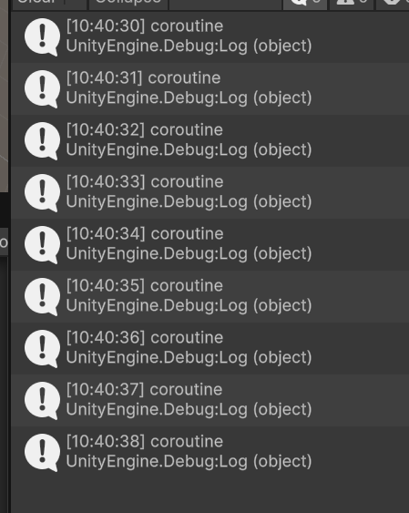

## 코루틴 실습 4: yield return null을 반복문 돌릴 때

1. 코드

```csharp
using System.Collections;
using UnityEngine;

public class CoroutineTest_LMS : MonoBehaviour
{
    private void Start()
    {
        StartCoroutine(Foo());
    }

    // 시작 -> 업데이트 -> yield

    private void Update()
    {
        Debug.Log("---Update---");
    }

    // yield return null을 반복문으로 돌리면, Update() 후에 매 프레임마다 yield return null에서 대기했다가
    // 즉, 다음 프레임까지 대기
    // 다음 루프를 진행
    private IEnumerator Foo()
    {
        Debug.Log("코루틴 실행");

        while(true)
        {
            // 다음 프레임(엡데이트 후)에 다시 이 부분부터 실행
            yield return null;

            Debug.Log("yield return null");
        }
    }
}
```

2. 결과: 
    ```
    - 코루틴은 유니티에서 따로 관리하며 코루틴 첫 실행 후 yield return null에서 일시정지되고, 다음 프레임에 다시 실행.

    - while(true) 안에 yield return null이 있기 때문에 매 프레임 마다 재개 후 로그 출력 그 다음 다시 yield return null에서 대기
    ```

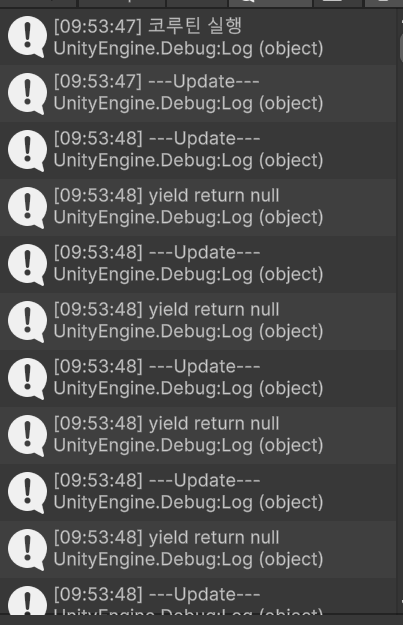

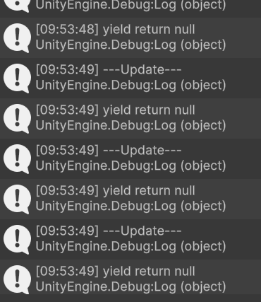

## 코루틴 실습 5: yield return new WaitForSeconds 출려 방식

1. 코드
```csharp
using System.Collections;
using UnityEngine;

public class CoroutineTest_LMS : MonoBehaviour
{
    private void Start()
    {
        StartCoroutine(Foo());
    }

    // 시작 -> 업데이트 -> yield

    private void Update()
    {
        Debug.Log("---Update---");
    }

    // yield return null을 반복문으로 돌리면, Update() 후에 매 프레임마다 yield return null에서 대기했다가
    // 다음 루프를 진행
    private IEnumerator Foo()
    {
        Debug.Log("코루틴 실행");

        while(true)
        {
            // WaitForSeconds는 클래스이며 new를 사용했으므로 일종에 객체이다.
            // WaitForSeconds는 새로 객체를 생성하면서 yield return에 전달.
            // WaitForSeconds는 원하는 시간 만큼 대기(업데이트 이후 실행)
            yield return new WaitForSeconds(1.5f);
            Debug.Log("yield return WaitForSeconds 1.5");
        }
    }
}
```

2. 결과: WaitForSconds의 시간 주기가 짧을수록 많은 객체가 생성되므로 조심해서 써야합니다.


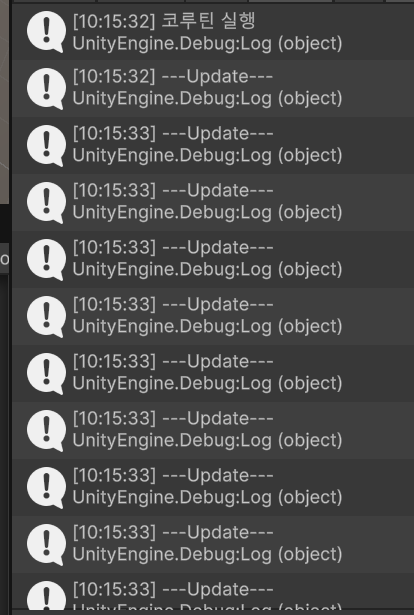

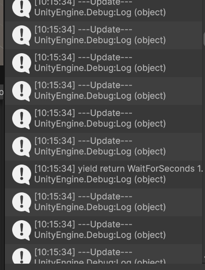

## 코루틴 실습 6: WaitForFixedUpdate() 

1. 코드
```csharp
using System.Collections;
using UnityEngine;

public class CoroutineTest_LMS : MonoBehaviour
{
    private void Start()
    {
        StartCoroutine(Foo());
    }

    private void FixedUpdate()
    {
        Debug.Log("---FixedUpdate---");
    }

    // 시작 -> 업데이트 -> yield
    private void Update()
    {
        Debug.Log("---Update---");
    }

    // yield return null을 반복문으로 돌리면, Update() 후에 매 프레임마다 yield return null에서 대기했다가
    // 다음 루프를 진행
    private IEnumerator Foo()
    {
        Debug.Log("코루틴 실행");

        while(true)
        {
            // FixedUpdate 까지 대기(FixedUpdate 이후)
            yield return new WaitForFixedUpdate();
            Debug.Log("yield return WaitForFixedUpdate");
        }
    }
}
```

2. 결과
    ```
    - FixedUpdate() 이후에 실행
    - yield return new WaitForFixedUpdate()은 다음 FixedUpdate까지 대기.
    - while문과 함께 사용하면 코루틴이 매 FixedUpdate마다 반복 실행된다.
    ```


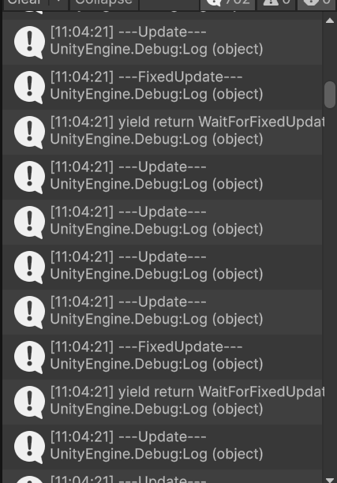

## 코루틴 실습 7: WaitForEndOfFrame()

1. 코드
```csharp
using System.Collections;
using UnityEngine;

public class CoroutineTest_LMS : MonoBehaviour
{
    private void Start()
    {
        StartCoroutine(Foo());
    }

    private void FixedUpdate()
    {
        Debug.Log("---FixedUpdate---");
    }

    // 시작 -> 업데이트 -> yield
    private void Update()
    {
        Debug.Log("---Update---");
    }

    // yield return null을 반복문으로 돌리면, Update() 후에 매 프레임마다 yield return null에서 대기했다가
    // 다음 루프를 진행
    private IEnumerator Foo()
    {
        Debug.Log("코루틴 실행");

        while(true)
        {
            yield return new WaitForEndOfFrame();
            Debug.Log("yield return WaitForEndOfFrame");
        }
    }
}
```

2. 결과
    ```
    - 프레임이 종료될 때 까지 대기하다가 프레임 종료 단계에서 로직 수행
    ```

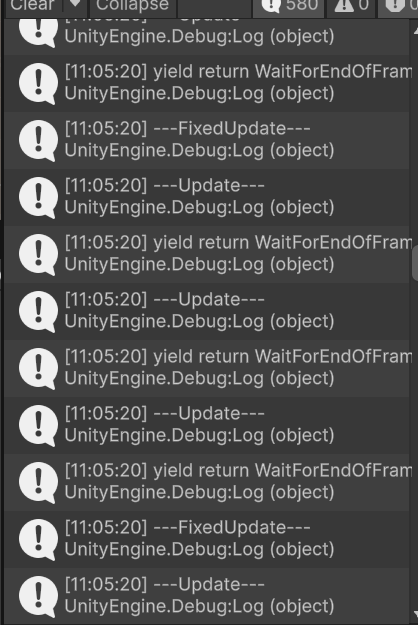

## 코루틴 실습 8: StartCoroutine

1. 코드
```csharp
using System.Collections;
using UnityEngine;

public class CoroutineTest_LMS2 : MonoBehaviour
{
    private void Start()
    {
        StartCoroutine(Foo());
    }

    private void FixedUpdate()
    {
        // Debug.Log("---FixedUpdate---");
    }

    private void Update()
    {
        // Debug.Log("---Update---");
    }

    private IEnumerator Foo()
    {
        Debug.Log("Foo 실행");
        // 코루틴 객체 또한 yield return 대상이 될 수 있음.
        yield return StartCoroutine(Boo());
        Debug.Log("Foo 종료");
    }

    private IEnumerator Boo()
    {
        Debug.Log("--Boo 실행");
        yield return new WaitForSeconds(1f);
        Debug.Log("--Boo 종료");
    }
}
```

2. 결과
    ```
    - StartCoroutine은 Coroutine을 반환
    - Coroutine은 클래스, WaitForSeconds와 마찬가지로 yieldInstruction을 상속 받음. 그래서 yield retunr을 쓸 수 있음
    ```
    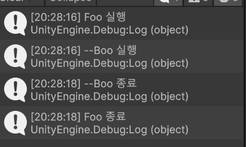

## 코루틴 실습9: WaitUntil

1. 
```csharp
using UnityEngine;
using System.Collections;
using UnityEditor;

public class CoroutineTest_LMS3 : MonoBehaviour
{
    private void Start()
    {
        StartCoroutine(Foo());
    }

    private void FixedUpdate()
    {
        Debug.Log("---FixedUpdate---");
    }

    private void Update()
    {
        Debug.Log("---Update---");

        // bool 타입의 _isBool이 false이므로 A를 누르면 true가 됨
        if(Input.GetKeyDown(KeyCode.A))
        {
            _isBool = !_isBool;
        }
    }

    // _isBool은 false
    private bool _isBool = false;

    private IEnumerator Foo()
    {
        Debug.Log("Foo 실행");

        // 특정 조건이 true가 될 때까지 대기
        yield return new WaitUntil(() => _isBool);
        // return new WaitWhile();

        // A를 누르면 _isBool이 true가 되어 Foo 종료
        Debug.Log("Foo 종료");
    }

}
```

2. 결과

    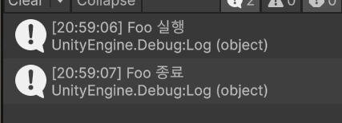

## 코루틴 실습 9: WaitWhile

1. 코드
```csharp
using UnityEngine;
using System.Collections;
using UnityEditor;

public class CoroutineTest_LMS3 : MonoBehaviour
{
    private void Start()
    {
        StartCoroutine(Foo());
    }

    private void FixedUpdate()
    {
        // Debug.Log("---FixedUpdate---");
    }

    private void Update()
    {
        // Debug.Log("---Update---");

        // bool 타입의 _isBool이 false이므로 A를 누르면 true가 됨
        if(Input.GetKeyDown(KeyCode.A))
        {
            _isBool = !_isBool;
        }
    }

    // _isBool은 false
    private bool _isBool = true;

    private IEnumerator Foo()
    {
        Debug.Log("Foo 실행");

        // 특정 조건이 false가 될 때까지 대기
        yield return new WaitWhile(() => !_isBool);

        // A를 누르면 _isBool이 false가 되어 Foo 종료
        Debug.Log("Foo 종료");
    }

}
```

2. 결과
    
    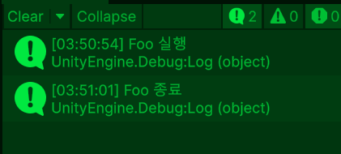
    
## 코루틴 실습 10: static readonly, Dictionary를 활용한 코루틴 실습

- static readonly
    ```
    1. 정적 필드(static) 가 읽기전용(ReadOnly) 임을 나타냄.
    2. 한 번 초기화 된 후에는 값을 변경할 수 없는 상수와 유사한 특성을 띔.
    3. 정적(static)멤버는 해당 클래스의 모든 인스턴스에서 공유되며, 읽기 전용(readonly) 으로 설정하면 한 번 설정된 값을 변경할 수 없게 됨.
    4. static readonly 를 사용하여 상수적인 값을 나타내거나, 특정 클래스 내에서 공유되는 상태를 유지하는 데에 활용.
    5. 클래스나 구조체의 멤버로만 존재할 수 있으며, 생성자 안에서 초기화가 가능.
    6. 선언시, 값을 할당하지 않아도 됨.
    7. static상수로 만들 경우에는 static생성자를 통해 초기화 할 수 있다.
    ```

- constant와 readonly 
    ```
    1. constant:
        a. 컴파일타임 상수로 런타임 중 값이 변경될 수 없다.
        b. 값을 변경할 수 없는 상수를 정의
        c. 반드시 선언과 동시에 초기화되어야 한다.
        d. private으로 지정했을 경우에는 문제가 없지만 public으로 지정해서 다른 클래스가 참조할 수 있게 했을 경우에는 버전 관리에 관한 문제가 발생할 위험.
        e. const로 정의한 값은 빌드할 때 값이 결정되므로 dll을 교체해도 exe는 여전히 예전 값을 사용해서 동작하게 된다.
        d. 변수의 선언과 동시에 값을 할당하며, 변경할 수 없다.
        e. 컴파일 시점에서 결정된 값이 변할 수 없음으로 모든 클래스의 인스턴스가 동일한 값을 가짐.
        e. 사용자 정의 클래스에는 적용하지 못하고, 내장 숫자, enum 문자열, null에 대해서만 활용 가능

        ** DLL은 Dynamic Link Library(동적 링크 라이브러리) 의 약자: 여러 프로그램이 공통으로 사용할 수 있는 코드 묶음 파일.
    
    2. readonly:
        a. 런타임 상수로 값이 변경 될 수 있는 값에 사용가능.
        b. readonly일 경우에는 실행할 때 값이 참조된다.
        c. dll을 교체해도 프로그램이 새로운 값을 사용해서 동작.
        d. 나중에 변경될 가능성이 있는 값을 상수로 지정해서 공개할 경우 static readonly 사용.
        e. 변수의 선언과 동시에 값을 할당할 수도 있지만, 생성자에서 1회 할당도 가능
        f. 런타임 시점에 와서야 값이 결정되니 같은 클래스라 하더라도 인스턴스에 따라 다른 값을 가질 수 있다. 
        g. 모든 타입에 대해서 사용할 수 있다.
    ```

- static 개념과 특징
    ```
    1. 클래스의 모든 인스턴스가 해당 변수를 공유
    2. 모든 인스턴스에서 공통으로 사용되어야 하는 데이터에 사용
    3. 인스턴스를 생성하지 않고도 클래스 자체에서 직접 호출할 수 있는 메서드.
    4. 인스턴스의 생성 없이 사용 가능한 유틸리티 메서드 등에 유용.
    ```
- constant와 readonly 사용 방법
    ```
    1. constant:
        a. Math.PI 같이 그 값이 불변하며 여러 클래스나 인스턴스에서 자주 사용되는 경우에 성능을 위해 적용
        b. 상수가 값이 절대 변하지 않을 예정이라면 성능을 위해 const를 선택
    
    2. readonly:
        a. 사용자 정의 타입이라면 const키워드를 적용하지 못하니 readonly 선택.
        b. 인스턴스마다 다른 값을 가지게 하고 싶다면 readonly를 선택.
    ``` 

1. 코드

    a. 
    ```csharp
    using UnityEngine;
    using System.Collections;
    using UnityEditor;

    public class CoroutineTest_LMS3 : MonoBehaviour
    {
        private void Start()
        {
            StartCoroutine(Foo());
        }

        private void FixedUpdate()
        {
            // Debug.Log("---FixedUpdate---");
        }

        private void Update()
        {
            // Debug.Log("---Update---");
        }

        private IEnumerator Foo()
        {
            Debug.Log("Foo 실행");

            // 1.5초 대기
            yield return yieldContainer.WaitForSeconds(1.5f);

            Debug.Log("Foo 종료");
        }
    }
    ```

    b.
    ```csharp
    using System.Collections.Generic;
    using UnityEngine;

    public static class yieldContainer
    {
        public static readonly WaitForFixedUpdate WaitForFixedUpdate = new WaitForFixedUpdate();
        private static readonly Dictionary<float, WaitForSeconds> _waitForSecondsDict = new Dictionary<float, WaitForSeconds>();


        // WaitForSeconds가 무분별하게 생성되는 것을 방지하기 위해 Dictionary에 저장하여 재사용하는 방식
        public static WaitForSeconds WaitForSeconds(float seconds)
        {
            // Dictionary에 안들어 있을 때 상황 대비
            if(!_waitForSecondsDict.ContainsKey(seconds))
            {
                _waitForSecondsDict.Add(seconds, new UnityEngine.WaitForSeconds(seconds));
            }

            return _waitForSecondsDict[seconds];
        }
    }
    ```

2. 결과
    - 1.5초 대기 후 종료

        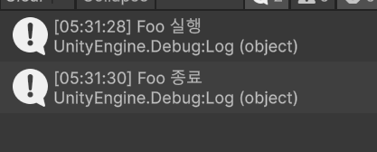

    - while(true)문 적용 시 1.5초 마다 무한 루프
        ```csharp
        private IEnumerator Foo()
        {
            Debug.Log("Foo 실행");
            while(true)
            {
                yield return yieldContainer.WaitForSeconds(1.5f);
                Debug.Log("Foo 실행중");
            }
            Debug.Log("Foo 종료");
        }    
        ```
        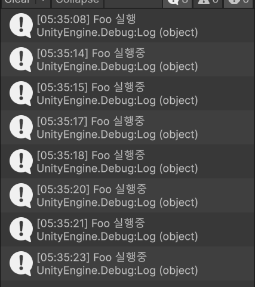

    - while(true)의 사용하고 일정 시간에 루프 종료

        ```csharp
        private IEnumerator Foo()
        {
            Debug.Log("Foo 실행");

            float timeCount = 0f;

            while (true)
            {
                yield return yieldContainer.WaitForSeconds(1.5f);
                timeCount += 1.5f;
                Debug.Log("Foo 실행중");

                if(timeCount >= 9f)
                {
                    break;
                }
            }
            Debug.Log("Foo 종료");
        }
        ```
        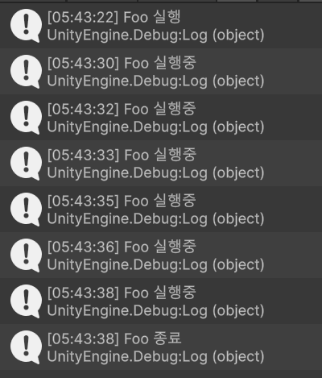
    
    - while 문 탈출이 아닌 코루틴 종료만 하는 경우
        ```csharp   
        private IEnumerator Foo()
        {
            Debug.Log("Foo 실행");

            float timeCount = 0f;

            while (true)
            {
                yield return yieldContainer.WaitForSeconds(1.5f);
                timeCount += 1.5f;
                Debug.Log("Foo 실행중");

                if(timeCount >= 9f)
                {
                    // 반환형 없는 상태에서 복잡한 조건을 쓸 때 사용
                    // 반환형 없는 함수에서의 return과 같음
                    // 반복문을 탈출이 아닌 코루틴 자체를 종료할 때 사용
                    yield break;
                }
            }
            Debug.Log("Foo 종료");
        }
        ```

        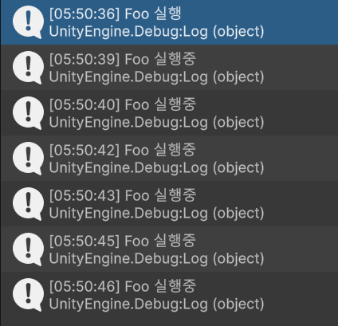
        


## 코루틴 실습 11: yield break로는 제어하기엔 제한이 있으므로 StopCoroutine을 사용하여 정확하게 상황에 맞춰서 외부에서 종료하기

1. 코드

    ```csharp
    using UnityEngine;
    using System.Collections;
    using UnityEditor;

    public class CoroutineTest_LMS4 : MonoBehaviour
    {
        // 클래스 필드에서 변수로 갖음
        // 값을 할당 하지 않은 상태면 == null상태
        // 코루틴이 동작 중인지 아닌지 null인지 판단해야 함.
        private Coroutine _fooCoroutine; 

        private void Start()
        {
            // StartCoroutine(Foo());
        }

        private void FixedUpdate()
        {
            // Debug.Log("---FixedUpdate---");
        }

        private void Update()
        {
            if(Input.GetKeyDown(KeyCode.Alpha1))
            {
                // null 체크해서 코루틴이 동작 중인지 아닌지 판단이 안되므로 무분별하게 StartCoroutine이 중복되어 실행될 수 있음
                // _fooCoroutine =  StartCoroutine(Foo());

                // 해당 코루틴이 null 일 때만 StartCoroutine이 실행
                // 중복 실행 방지
                if (_fooCoroutine == null)
                {
                    _fooCoroutine = StartCoroutine(Foo());
                }
            }

            if(Input.GetKeyDown(KeyCode.Alpha2))
            {
                // null이 아니면 종료
                if (_fooCoroutine != null)
                {
                    StopCoroutine(_fooCoroutine);

                    // 코루틴이 종료된 후 null로 초기화
                    _fooCoroutine = null;
                }
            }
        }
    }
    ```

2. 결과

    - 1을 누르면 코루틴 실행, 2를 누르면 중지 다시 1을 누르면 코루틴 실행
    - 이 코드는 코루틴의 동기 함수로 순차적으로 코드가 실행되는 것처럼 순차적으로 코드를 실행

    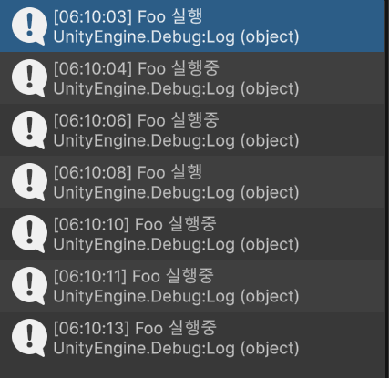

    - 아래 코드는 코루틴의 비동기 함수로 내가 원하는 상황에서 일시 정지 후 다시 실행.
    - 코루틴은 비동기로 보이지만 유니티 내부 적으론 동기 함수로 흘러감.
    ```
     private IEnumerator Foo()
    {
        Debug.Log("Foo 실행");

        float timeCount = 0f;

        while (true)
        {
            yield return yieldContainer.WaitForSeconds(1.5f);
            Debug.Log("Foo 실행중");
        }
    }
    ```

## 코루틴 실습 12: 코루틴과 deltatime을 활용한 일시정지

1. 코드
    a. 

        ```csharp
        using UnityEngine;

        public class CubeControllerTest_Coroutine : MonoBehaviour
        {
            private void Update()
            {
                // deltaTime은 Time.timeScale의 영향을 받음
                // deltaTime 값이 있으면 Time.timeScale이 0이 되면 deltaTime도 0이 되어 회전이 멈춤.
                // deltaTime이 없으면 Time.timeScale이 0이 되어도 여전히 회전함
                transform.Rotate(Vector3.up, 5 * Time.deltaTime);
            }
        }
        ```
    
    b. 

        ```csharp
        using UnityEngine;
        using System.Collections;
        using UnityEditor;

        public class CoroutineTest_LMS4 : MonoBehaviour
        {
            // 클래스 필드에서 변수로 갖음
            // 값을 할당 하지 않은 상태면 == null상태
            // 코루틴이 동작 중인지 아닌지 null인지 판단해야 함.
            private Coroutine _fooCoroutine; 

            private void Start()
            {
                // StartCoroutine(Foo());
            }

            private void FixedUpdate()
            {
                // Debug.Log("---FixedUpdate---");
            }

            private void Update()
            {
                if(Input.GetKeyDown(KeyCode.Alpha1))
                {
                    // null 체크해서 코루틴이 동작 중인지 아닌지 판단이 안되므로 무분별하게 StartCoroutine이 중복되어 실행될 수 있음
                    // _fooCoroutine =  StartCoroutine(Foo());

                    // 해당 코루틴이 null 일 때만 StartCoroutine이 실행
                    // 중복 실행 방지
                    if (_fooCoroutine == null)
                    {
                        _fooCoroutine = StartCoroutine(Foo());
                    }
                }

                if(Input.GetKeyDown(KeyCode.Alpha2))
                {
                    // null이 아니면 종료
                    if (_fooCoroutine != null)
                    {
                        StopCoroutine(_fooCoroutine);

                        // 코루틴이 종료된 후 null로 초기화
                        _fooCoroutine = null;
                    }
                }

                if(Input.GetKeyDown(KeyCode.P))
                {
                    Time.timeScale = 0;
                    Debug.Log("큐브 일시정지");
                }
            }

            private IEnumerator Foo()
            {
                Debug.Log("Foo 실행");

                float timeCount = 0f;

                while (true)
                {
                    yield return yieldContainer.WaitForSeconds(1.5f);
                    Debug.Log("Foo 실행중");
                }
            }
        }
        ```

2. 결과

    - deltaTime은 Time.timeScale의 영향을 받음
    - deltaTime 값이 있으면 Time.timeScale이 0이 되면 deltaTime도 0이 되어 회전이 멈춤.
    - timeScale을 0으로 만들면 게임 내부적으로 코루틴도 같이 멈추게 됨.

    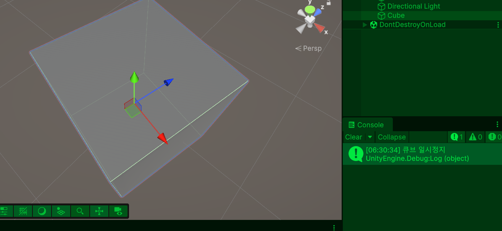

    - delataTime: 프레임과 프레임 사이의 시간을 뜻하며 deltaTime이 없으면 0이 되므로 연산이 안됨.
    - deltaTime 값이 있으면 Time.timeScale이 0이 되면 deltaTime도 0이 되어 회전이 멈춤.

    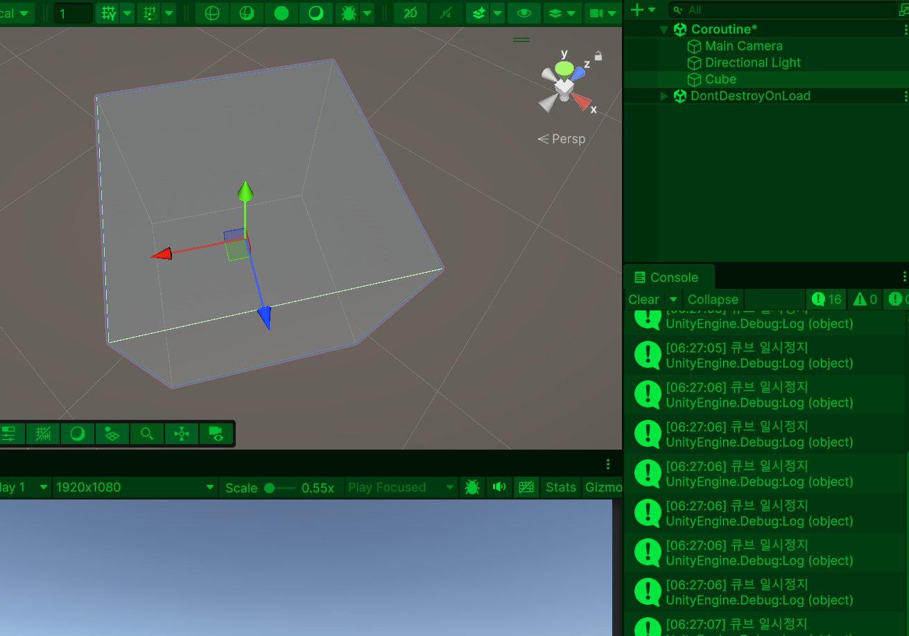

    - WaitForSeconds 대신 WaitForSecondsRealtime 사용시 게임을 일시 정지해도 지정된 시간 후에 코루틴 재개
    - WaitForSeconds는 게임 시간의 영향을 받고, WaitForSecondsRealtime은 실제 시간의 영향을 받음
    - WaitForSecondsRealtime은 게임 일시정지 후 지정한 시간 후에 팝업(게임 종료: 예, 아니오) 표시에 사용

    - WaitForSeconds를 쓰면 코루틴과 게임 실행 중 일시정지 하고 다시 코루틴 실행해도 코루틴 재개 못하고 그대로 멈추게 됨
        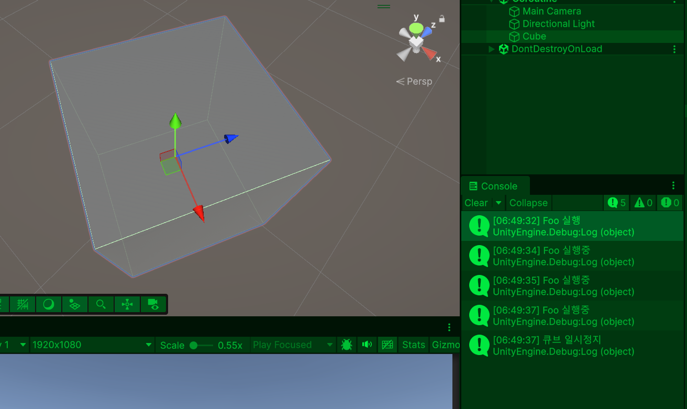

    - WaitForSecondsRealtime을 쓰면 코루틴과 게임 실행 중 일시정지하면 다시 코루틴 재개 가능
        ```
        yield return new WaitForSecondsRealtime(0.5f);
        ```
        
        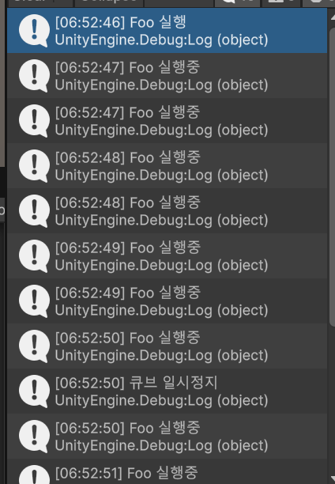


## 참고 자료

- 코루틴 개념 및 특징
1. https://wikidocs.net/296926
2. DevelRocket 강의 녹화본
3. https://skystory.tistory.com/15
4. https://velog.io/@jh11240/%EC%9C%A0%EB%8B%88%ED%8B%B0-yield-return%EA%B3%BC-stopcoroutine
5. https://govleen79.tistory.com/55
6. https://www.slideshare.net/slideshow/ienumerator/63417218

- 코루틴 캐싱
1. https://velog.io/@hagwhr2/Unity-Coroutine
2. https://velog.io/@zxllo12/%EC%9C%A0%EB%8B%88%ED%8B%B0-%EC%BD%94%EB%A3%A8%ED%8B%B4-%EC%82%AC%EC%9A%A9-%EC%8B%9C-%EB%AC%B8%EC%A0%9C%EC%A0%90-%EC%A3%BC%EC%9D%98%ED%95%A0-%EC%A0%90

- 예외와 예외처리
1. https://pledge24.tistory.com/404

- Thread, 동기, 비동기
1. https://velog.io/@chas369/%EB%8F%99%EA%B8%B0-%EB%B9%84%EB%8F%99%EA%B8%B0-%EC%8B%B1%EA%B8%80-%EC%8A%A4%EB%A0%88%EB%93%9C-%EB%A9%80%ED%8B%B0-%EC%8A%A4%EB%A0%88%EB%93%9C
2. https://ljhyunstory.tistory.com/284#google_vignette

- Thread와 Coroutine 차이
1. https://moondongjun.tistory.com/35
2. https://hyunee-egeojeogeo.tistory.com/179
3. https://tears2am.tistory.com/64

- 콜백함수
1. https://blog.naver.com/lavacat94/223336609062
2. https://lhc8224.tistory.com/55

- 람다식 대신 클래스 멤버로 쓰기
1. https://velog.io/@hyeon23/UnityC%EC%93%B0%EB%A0%88%EB%93%9CThread

- static, readonly, constant
1. https://m.blog.naver.com/lavacat94/223336623973
2. https://myoung-min.tistory.com/17
3. https://mentum.tistory.com/565
4. https://art-life.tistory.com/149#google_vignette