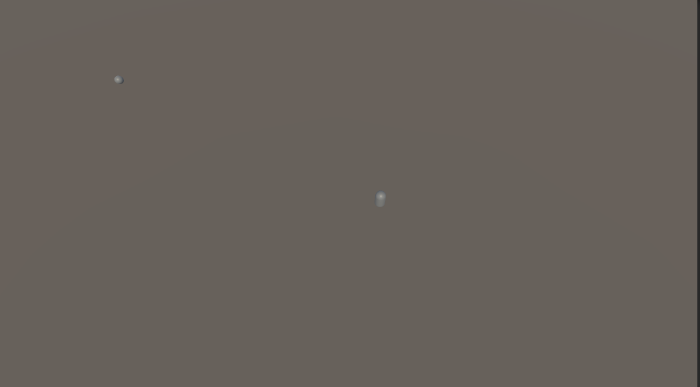
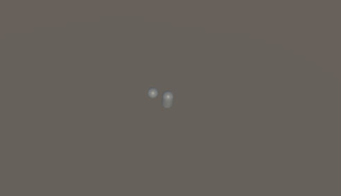

# Unity Event, Action

## 대리자

### ⭐ 개념

1. 특정 매개 변수 목록 및 반환 형식이 있는 메서드에 대한 참조를 나타내는 형식
2. 매개 변수와 반환 형식이 정해져 있으면, 그 메서드들을 참조할 수 있게 해주는 형식

### ⭐ 특징

1. 콜백:
    ```
    a. 메서드를 매개변수 형태로 전달 할 수 있고, 특정 조건이 되면 대리자에 참조되어있는 함수들을 한번에 실행할 수 있게 해줌.
    b. 다른 코드가 완료된 후 호출되는 함수
    ```

2. 매개변수/리턴 타입을 가진 메서드들을 대리자가 묶어서 관리하고, 한번에 호출
3. 대리자 타입을 통해 함수의 매개 변수로도 전달 가능

** 메서드: 특정 기능을 수행하는 코드 묶음
    ```
    private void Attack()
    {
        Debug.Log("공격!");
    }
    -> Attack()이 메서드
    ```

** 매개변수: 메서드에 전달받는 값
    ```
    private void Name(string name)
    {
    Debug.Log(name);
    }
    -> string name이 매개변수
    ```

#### ✅ 정적과 동적

1. 정적
    ```
    a. unity inspector에서 Static 체크박스
    b. 움직이지 않는 오브젝트
    c. static 변수
    d. 모든 객체가 공유
    e. Collider O, Rigidbody X
    ```

2. 동적
    ```
    a. 객체마다 따로 존재
    b. 움직이는 모든 오브젝트
    d. Collider O, Rigidbody O
    ```
### ⭐ 대리자 종류

1. delegate
    ```
    a. 메서드의 매개변수와 반환 타입을 지닌 대리자 형식.
    b. 특정 형태의 메서드를 참조할 수 있는 타입.
    c. 사용 시 델리게이트 형식을 만들고, 그 형식을 객체로 선언 후, 메서드와 그 객체를 연결시켜줘야 한다.
    d. 메서드를 매개변수로 전달하거나 런타임에 메서드를 동적으로 변경가능.
    e. new delegate 타입(메서드이름)으로 추가 방식 존재.
    f. 메서드 이름으로 추가 방식 존재.
    g. 람다식(=>)으로 대리자를 선언 후 바로 메서드 객체로 만들어 추가 방식 존재.
    h. 델리게이트 타입의 변수는 event 키워드를 붙여 선언가능.
    ```

2. Func
    ```
    a. 반환 타입이 void가 아닌 메서드를 담는 델리게이트 형식.
    b. delegate와 다르게 따로 형식을 지정할 필요가 없고, 제네릭으로 반환 타입과 매개 변수들을 입력.
    c. 만약 매개변수가 없다면 매개변수 타입을 제외하고 리턴 타입만 하나 지정해준다.
    d. 대표 형식: Func<리턴 타입> MyFunc; 
    ```

3. Action(delegate)
    ```
    a. 반환 타입이 void인 반환 타입이 없는 메서드를 담는 델리게이트 형식.
    b. 따로 형식을 지정해줄 필요 없이, 제네릭으로 매개 변수를 지정해주며 된다.
    c. 만약 반환 타입가 void면서 매개 변수도 없다면 제네릭으로 지정하지 않고 Action 키워드로만 델리게이트 객체를 선언가능.
    d. 대표 형식: Action<매개 변수> myAction;
    f. 람다식(=>) 함수로 람다식을 활용해 바로 델리게이트 인스턴스를 만들어 추가하는 것이 가능.
    g. 괄호를 붙이지 않고 이름만 명시하고 +=를 사용해 메서드를 등록가능.
    h. 괄호를 붙이면 메서드를 '등록'하는 것이 아니라'실행'하고 그 반환값을 할당.
    ```

4. Event
    ```
    a. Inspector에서 시각적으로 이벤트를 연결하고 관리할 수 있게 해주는 메커니즘
    a. 델리게이트를 클래스 외부로 공개하며 delegate 객체를 선언 시 event 키워드를 붙임
    b. 견고한 커플링 문제를 해소
    c. delegate 타입의 변수는 event 키워드를 붙여 선언 할 수 있으며, 이벤트를 소유하지 않은 측에서 멋대로 이벤트를 발동하는 것을 막음.
    e. delegate는 Invoke 멤버 함수를 통해 멋대로 호출, 접근 한정자를 public으로 지정 시 delagate 객체를 대입 연산자(=)를 써서 멋대로 바꿀 수 있어서 이를 보완하기 위해 Event를 씀.
    f. 클래스 외부에서 이벤트 델리게이트에게 대입 연산자(=)는 사용 못하고 기존 메서드 인스턴스를 구독 또는 해제(+=, -=)만 사용가능.
    g. 클래스 외부에서 Invoke로 델리게이트 객체의 메서드들을 호출 불가능.
    ```

** 견고한 커플링: 어떤 클래스가 다른 클래스의 구현에 강하게 결합되어 코드를 유연하게 변경할 수 없는 상태.

### ⭐ C# Event와 Unity Event 특징 및 차이점

1. C# Event
    ```
    a. C# 델리게이트 기반으로 코드에서 구독.
    b. 흐름도: 이벤트 정의 -> 구독자 등록 -> 이벤트 발생 -> 구독자들의 메서드 실행
    c. "특정 상황이 발생했음" 을 다른 클래스에게 알리는 메커니즘.
    d. 특정 상황이 발생했을 때 실행되는 델리게이트의 일종.
    e. 주로 사용자 입력, 데이터 변경, 시스템 상태 변화 등의 이벤트를 처리하는 데 사용.
    f. 캡슐화가 잘 됨.
    g. 성능이 가장 좋음.
    h. 게임 상태 변경 통지, 캐릭터 상태 변경 알림, 시스템 간 통신, 데이터 모델 변경 알림 등에 사용.
    ```
** 캡슐화: 데이터(변수)를 보호하고, 정해진 방법(메서드)을 통해서만 접근하도록 만드는 것

2. Unity Event
    ```
    a. 직렬화된 이벤트.
    b. 인스펙터에서 설정(Inspector에서 시각적으로 이벤트를 연결하고 관리)
    c. 유니티 이벤트 흐름: 유니티 이벤트 정의 -> 인스펙터에서 연결 -> AddListener 연결 -> Invoke 호출.
    d. 런타임 중에도 동적으로 리스너 추가/제거 가능.
    e. 성능은 C# Event보다 약간 느림.
    f. UI 버튼 클릭 이벤트, 씬 전환 이벤트에 사용.
    ```

3. 성능적 이점
    ```
    a. C# event가 Unity Event보다 성능이 좋고 빨라서 매 프레임 마다 호출되는 이벤트에 적합.
    b. 성능이 C# Event가 좋고 실제 개발에서 Unity Event 보 많이 쓰임.
    ```

4. 코드 관리
    ```
    a. Inspector에서 연결괸 이벤트(Unity Event)는 나중에 디버깅이 어려움.
    b. 코드로 관리되는 C# Event는 추적과 디버깅이 용이.
    c. 버전 관리(git등)에서도 코드로 관리되는 C# Event가 더 안정적.
    ```

5. 안정성
    ```
    a. Unity Event는 Inspector에서 잘못된 연결이 발생할 수 있다.
    b. C# Event는 컴파일 시점에 타입 체크가 되어 더 안전.
    ```

6. Unity Event가 주로 쓰인다면
    ```
    a. UI 버튼 클릭 이벤트처럼 디자이너가 직접 설정해야 하는 경우.
    b. 프리팹 단위로 이벤트 설정을 저장해야 하는 경우.
    c. 런타임에서 동적으로 이벤트 연결을 변경해야 하는 경우.
    ```


### Unity Event Action과 delegate Action 특징과 차이점

1. Unity Event Action
    ```
    a. 선언된 클래스 내에서만 호출 가능
    b. +=/-=로 구독/해제 가능
    c. 선언된 클래스 내부에서만 호출 가능, 외부에서는 구독/해제만 가능
    d. 캡슐화가 됨 (외부에서 제한된 접근만 가능)
    ```

2. delegate Action
    ```
    a. C#에서 제공하는 델리게이트의 한 종류로 반환값이 없는 메서드를 참조할 수 있는 타입.
    b. 람다/익명 함수
    c. 람다식 사용 가능, 일회성 이벤트에 적합, 구독자 관리가 다소 까다로움
    d. 비동기 작업 완료 콜백.
    e. 임시 이벤트 처리.
    f. 간단한 함수 콜백(누구나 직접 호출, 할당 가능)
    g. 람다식을 활용한 동적 이벤트 처리.
    h. Event Action에선 +=/-=로 구독/해제 가능하지만 오직 람다식만 쓸 수 있다.
    i. 외부에서 이렇게 직접 할당 가능
    j. gameManager.Destroyer = () => Debug.Log("파괴");
    k. 누구나 직접 호출, 할당, null 설정 가능
    L. 캡슐화가 되지 않음 (외부에서 완전한 제어 가능)
    ```

## 유니티 이벤트 실습 1: 플레이어가 펫을 호출하면 펫이 플레이어를 향해 이동

1. 코드

    a. 

    ```csharp
    using UnityEngine;
    using UnityEngine.Events;
    using System.Collections;

    public class PlayerController : MonoBehaviour
    {
        // 이벤트는 클래스로 구성되어 있으며 인스턴스로 생성해서 사용.
        // Unity Action은 델리게이트로 구현되어 있음. 
        // 즉 델리게이트와 이벤트처럼 함수를 등록해 놓고 이벤트 발생 시 등록된 함수들을 실행
        [field: SerializeField] public UnityEvent OnPetCalled { get; private set; } = new();

        private void Update()
        {
            if(Input.GetKeyDown(KeyCode.C))
            {
                CallPet();
            }
        }

        private void CallPet()
        {
            // 유니티 이벤트를 Invoke로 실행
            OnPetCalled.Invoke();
        }

    }
    ```

    b. 

    ```csharp
    using System.Collections;
    using System.Collections.Generic;
    using UnityEngine;

    public class PetController : MonoBehaviour
    {
        [SerializeField] private PlayerController _player;
        [SerializeField] private float _moveSpeed;
        [SerializeField] private float _moveStopDistance;
        private Coroutine _moveCoroutine;

        // MoveToPlayer 함수에서 Coroutine이 실행 중이지 않으면 Coroutine을 실행하고 이동 위치로 플레이어의 트랜스폼을 넘김
        public void MoveToPlayer()
        {
            if(_moveCoroutine == null)
            {
                _moveCoroutine = StartCoroutine(MoveToTarget(_player.transform));
            }
        }

        // 코루틴과 반복문을 활용.
        // 내부에서 목표 지점과 자신의 위치 사이의 거리가 필드 변수보다 가까우면 Coroutine을 정지
        private IEnumerator MoveToTarget(Transform target)
        {
            while(true)
            {
                float distance = Vector3.Distance(
                    target.transform.position,
                    transform.position
                    );

                // 거리가 멈춰야 할 거리에 도달 시 코루틴이 null이되며 코루틴 잠시 정지
                if(distance <= _moveStopDistance)
                {
                    _moveCoroutine = null;
                    yield break;
                }

                transform.position = Vector3.MoveTowards(
                    transform.position,
                    target.position,
                    _moveSpeed * Time.deltaTime
                    );

                yield return null;
            }
        }
    }
    ```


    

    

### 참고 자료

- 대리자와 event
    1. https://velog.io/@luz0415/%EB%8C%80%EB%A6%AC%EC%9E%90-delegate-Func-Action
    2. https://wookeee.tistory.com/entry/Unity-%EC%9C%A0%EB%8B%88%ED%8B%B0-1-Action-%EC%9D%B4%EB%B2%A4%ED%8A%B8-event

- C# event와 Unity Event
    1. https://tears2am.tistory.com/56
    2. https://lhc8224.tistory.com/55
