# RayCast

## 1. 개념
- 보이지 않는 광선을 쏴서, 그 광선이 어떤 오브젝트 Collider에 맞았는지 검사

## 2. Raycast에 필요한 것
- 시작 위치
- 방향
- 거리

## 3. Raycast 대표적 cs
```csharp
Physics.Raycast(transform.position, transform.forward, 10f);
```
플레이어로부터 앞 방향으로 10만큼 광선(Ray) 발사


## 4. Raycast 작동 순서
플레이어에서 지정한 거리만크 Ray 발사 -> Ray 범위 안에 오브젝트 Collider가 있으면 True -> 맞은 정보가 hit(결과 저장 변수)에 저장 -> hit.collider.name 출력

## 5. RaycastHit
- 충돌체(정보)
- hit: Raycast가 맞춘 결과 정보
- 대표적인 것:
    ```csharp
    hit.collider   // 맞은 Collider
    hit.point      // 맞은 위치
    hit.distance   // 맞은 거리
    hit.normal     // 맞은 표면 방향
    ```

## 6. Raycast 특징
- Ray에 맞을 오브젝트에 Collider가 있어야 함
- 판정이 빠름
- 거리를 조정하여 원하는 거리만큼 검사 가능
- 특정 Layer만 검사 가능
- Trigger Collider 맞출지 선택 가능   
- 대표적으로 쓰이는 곳: 총 발사 판정, 마우스 클릭 판정, 적 시야 검사, 장애물 검사, 바닥 체크, 상호작용 아이템 및 문 등 검사 

## Raycast 실습 1: Raycast 쏴서 충돌체 정보 호출

- Ray 내부 구조
1. Ray는 구조체로 선언되어있슴.
2. Ray 내부에는 생성자와 origin, direction과 같은 프로퍼티를 확인가능.
3. 거리를 매개변수로 Ray가 도달한 곳의 좌표를 반환받는 함수도 확인가능.

- RaycastHit 내부 구조
1. 충돌체를 보관하는 구조체
2. 내부에서 Collider, 충돌체의 위치, Ray가 충돌한 충돌체의 표면 좌표, Transform, Rigiedboy들이 프로퍼티로 선언되어있으므로 다양한 방식으로 충돌체의 데이터를 가져올 수 있다.

- Physics 클래스
1. 3D 물리 엔진 기능을 제공하는 정적(static) 클래스

2. static 클래스로 객체 생성 안 함.

```csharp
Physics.Raycast
Physics.OverlapSphere
Physics.IgnoreLayerCollision
Physics.gravity
```

3. Physics 이용 대표 예시
```csharp
SphereCast: 구체 형태 검사

Physics.SphereCast(...): 박스 형태 검사
BoxCast

Physics.BoxCast(...): 범위 안 Collider 찾기
OverlapSphere

Physics.OverlapSphere(...): 범위 안 존재 여부
CheckSphere

Physics.CheckSphere(...): 레이어 충돌 무시
IgnoreLayerCollision
```

3. 충돌 검사, Raycast, SphereCast, Overlap 검사, 중력 설정

4. 레이어 충돌 설정 다양한 방법으로 사용하기 위해 오버로딩

5. 오버로딩: 매개변수(파라미터)가 다르면 여러 개 만들 수 있는 기능
```csharp
// 앞으로 레이쏘는 기능
Physics.Raycast(
    transform.position,
    transform.forward
);

// 거리추가
Physics.Raycast(
    transform.position,
    transform.forward,
    100f
);
```

- 코드

```csharp
using UnityEngine;

// 1. 선택된 캐릭터만 이동 가능
// 2. 선택된 캐릭터만 앞쪽으로 Raycast를 쏴서 물체 감지
public class CharacterController : MonoBehaviour
{
    // 이동 속도
    [SerializeField] private float _moveSpeed;

    // 회전 속도
    [SerializeField] private float _rotateSpeed;

    // 앞쪽 감지 거리
    [SerializeField] private float _detectSightDistance;

    // Rigidbody 컴포넌트 저장용 변수
    // 실제 이동은 Rigidbody의 linearVelocity로 처리
    private Rigidbody _rigidbody;

    // 이 캐릭터가 현재 선택되었는지 여부
    // true면 이동 가능 + 전방 감지 실행
    // false면 아무 동작 안 함
    public bool IsSelect;

    private void Awake()
    {
        Init();
    }

    private void Update()
    {
        // 선택된 캐릭터만 조작 가능
        if (IsSelect)
        {
            // 키보드 입력으로 이동
            SetMove();

            // 캐릭터 앞쪽에 물체가 있는지 감지
            DetectObjectInFront();
        }
    }

    private void Init()
    {
        // 이 오브젝트에 붙어있는 Rigidbody 컴포넌트를 가져옴
        _rigidbody = GetComponent<Rigidbody>();
    }

    // 캐릭터 이동 처리 함수
    private void SetMove()
    {
        // 키보드 입력값을 방향 벡터로 가져옴
        Vector3 direction = GetDirectionFromInput();

        // 입력이 없으면
        if (direction == Vector3.zero)
        {
            // 이동 속도를 0으로 만들어 멈춤
            _rigidbody.linearVelocity = Vector3.zero;
            return;
        }

        // 입력 방향을 바라보도록 회전
        // Quaternion.LookRotation(direction) : direction 방향을 바라보는 회전값 생성
        // Quaternion.Lerp : 현재 회전에서 목표 회전으로 부드럽게 회전
        _rigidbody.transform.rotation = Quaternion.Lerp(
            transform.rotation,
            Quaternion.LookRotation(direction),
            _rotateSpeed * Time.deltaTime
            );

        // 입력 방향으로 이동
        // linearVelocity는 Rigidbody의 현재 속도
        _rigidbody.linearVelocity = _moveSpeed * direction;
    }

    // 키보드 입력값을 Vector3 방향으로 변환하는 함수
    private Vector3 GetDirectionFromInput()
    {
        Vector3 dir = Vector3.zero;

        // A, D 또는 ←, → 입력
        // A = -1, D = 1
        dir.x = Input.GetAxisRaw("Horizontal");

        // W, S 또는 ↑, ↓ 입력
        // S = -1, W = 1
        dir.z = Input.GetAxisRaw("Vertical");

        // 대각선 이동 시 속도가 빨라지는 문제를 막기 위해 normalized 사용
        // normalized: 
        return dir.normalized;
    }

    // 캐릭터 앞쪽에 물체가 있는지 Raycast로 감지하는 함수
    private void DetectObjectInFront()
    {
        // Ray 생성
        // 시작 위치: 캐릭터 현재 위치
        // 방향: 캐릭터가 바라보는 앞 방향
        Ray ray = new Ray(transform.position, transform.forward * _detectSightDistance);

        // Ray에 맞은 물체 정보를 저장할 변수
        RaycastHit hit;

        // Ray를 쏴서 물체에 맞았는지 검사
        // _detectSightDistance 거리 안에 Collider가 있으면 true
        if (Physics.Raycast(ray, out hit, _detectSightDistance))
        {
            // 감지된 오브젝트 이름 출력
            Debug.Log($"{name} : {hit.transform.name} 발견!");
        }
    }
}
```

```csharp
using UnityEngine;

// 캐릭터들을 생성하고,
// 마우스로 클릭한 캐릭터를 선택하는 관리자 스크립트
public class ObjectManager : MonoBehaviour
{
    // 생성할 캐릭터 프리팹
    [SerializeField] private GameObject _characterPrefab;

    // 캐릭터가 랜덤으로 생성될 위치 범위
    [SerializeField] private float _positionScope;

    // 메인 카메라 저장용 변수
    private Camera _cam;

    // 현재 선택된 캐릭터의 CharacterController
    private CharacterController _target;

    // 현재 선택된 캐릭터의 Transform
    private Transform _targetTransform;

    // 마우스 클릭 위치에서 발사할 Ray
    private Ray _ray;

    private void Awake()
    {
        Init();
    }

    private void Update()
    {
        // 마우스로 오브젝트 선택 시도
        TryGetObjectHandle();
    }

    private void Init()
    {
        // 씬의 MainCamera 태그가 붙은 카메라를 가져옴
        _cam = Camera.main;

        // 캐릭터 프리팹을 3개 생성하고 이름 변경
        CreateObject(_characterPrefab).name = "Kim";
        CreateObject(_characterPrefab).name = "Lee";
        CreateObject(_characterPrefab).name = "Park";
    }

    // 프리팹을 생성하는 함수
    private GameObject CreateObject(GameObject prefab)
    {
        // 프리팹 복제 생성
        GameObject obj = Instantiate(prefab);

        // 생성된 오브젝트 위치를 랜덤으로 설정
        obj.transform.position = new Vector3(
            Random.Range(-_positionScope, _positionScope),
            0f,
            Random.Range(-_positionScope, _positionScope)
            );

        // 생성된 오브젝트의 Y축 회전을 랜덤으로 설정
        obj.transform.rotation = Quaternion.Euler(
            0,
            Random.Range(0, 360),
            0
            );

        // 생성된 오브젝트 반환
        return obj;
    }

    // 마우스로 캐릭터를 선택하는 함수
    private void TryGetObjectHandle()
    {
        // 마우스 왼쪽 버튼을 누르고 있는 동안 실행
        if (Input.GetMouseButton(0))
        {
            // 화면상의 마우스 위치를 기준으로 Ray 생성
            // ScreenPointToRay : 화면상의 좌표를 레이로 변환, 카메라 클래스에서 제공하는 함수
            _ray = _cam.ScreenPointToRay(Input.mousePosition);

            // Ray에 맞은 물체 정보를 저장할 변수
            RaycastHit hit;

            // Ray를 쏴서 Collider가 있는 오브젝트를 맞췄는지 검사
            if (Physics.Raycast(_ray, out hit))
            {
                // 이미 선택된 오브젝트를 다시 클릭하고 있으면 아무 처리 안 함
                if (_targetTransform == hit.transform)
                {
                    return;
                }

                // 기존에 선택된 캐릭터가 있으면 선택 해제
                if (_target != null)
                {
                    _target.IsSelect = false;
                }

                // 새로 클릭한 오브젝트의 Transform 저장
                _targetTransform = hit.transform;

                // 클릭한 오브젝트에서 CharacterController 컴포넌트 가져오기
                _target = _targetTransform.GetComponent<CharacterController>();

                // 새로 클릭한 캐릭터 선택 상태로 변경
                _target.IsSelect = true;
            }
        }
    }
}
```

- 결과

1. Character나 다른 오브젝트를 선택해서 각각 움직여서 서로 마주보게 했을 때 -> '선택된 오브젝트 이름: 마주치게된 오브젝트' 발견!
2. 캐릭터 오브젝트를 움직여서 Kim 오브젝트와 접촉하고 하이어라키에서 Kim 오브젝트를 선택한 상태면 'Kim 발견!'이 매 프레임마다 호출
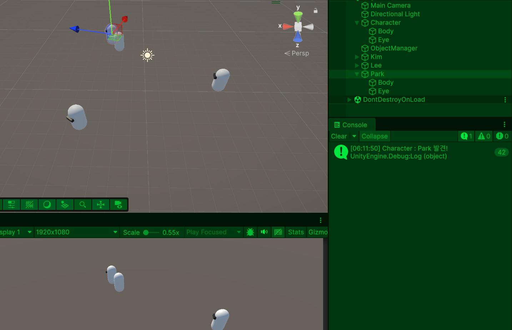

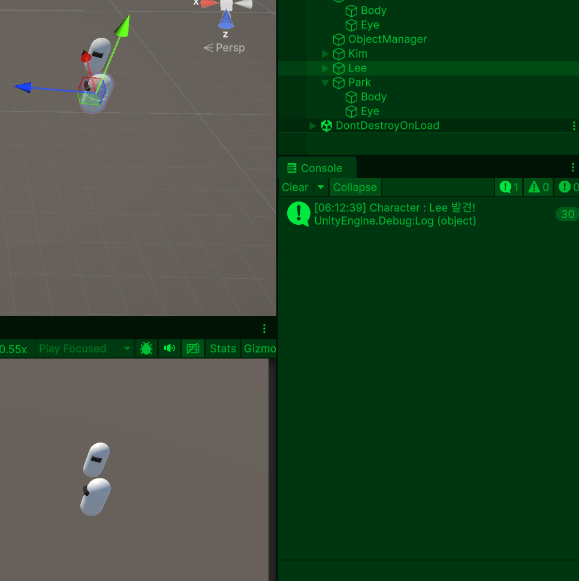

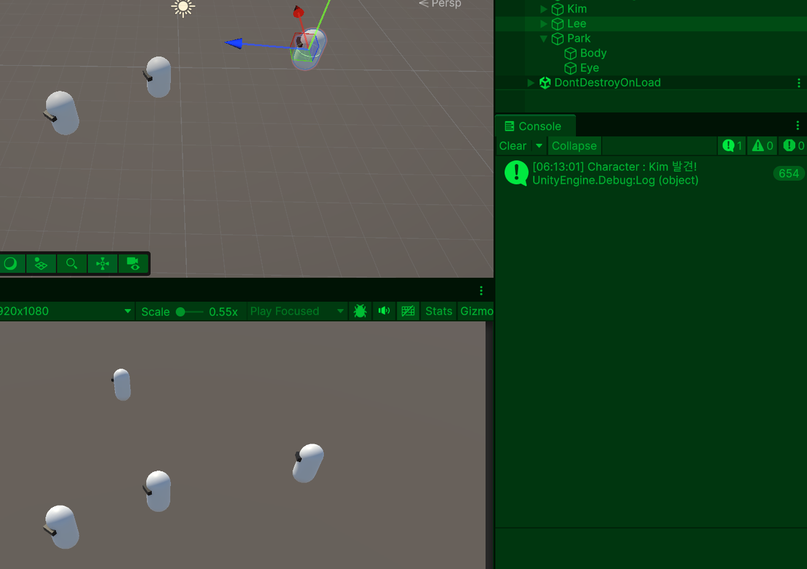

## 7. Gizmo

### 개념
1. Raycast를 눈으로 확인하기 위한 시각화 도구
2. 라이프 사이클에서 Update()와 OnDisable() 이벤트 사이에 호출
3. Gizmo 함수 내부에 프로퍼티로 색상뿐 아니라 다양한 옵션 설정 가능

### 기즈모의 특징

1. 기즈모는 Game 뷰가 아니라 Scene 뷰에서 확인하는 용도입니다.
2. 게임 플레이 중 실제 유저에게 보이는 선이 아닙니다.
3. 성능 테스트용이나 디버그용으로 많이 씁니다.
4. Collider 범위, Raycast 방향, 공격 범위, 감지 범위, 이동 경로 등을 확인할 때 사용합니다.

### 기즈모의 핵심 개념

1. 보통 쓰이는 함수
```csharp
private void OnDrawGizmos()
{
    
}
```

2. 선택된 오브젝트만 보이게 하기
```csharp
private void OnDrawGizmosSelected()
{
    
}
```

3. OnDrawGizmos(), OnDrawGizmosSelected() 차이점
- OnDrawGizmos(): 오브젝트를 선택하지 않아도 Scene 뷰에 계속 보임.
- OnDrawGizmosSelected(): 오브젝트를 선택했을 때만 Scene 뷰에 보임.

4. Raycast 방향을 기즈모로 표시하기
```csharp
[SerializeField] private float _detectSightDistance = 5f;

private void OnDrawGizmos()
{
    Gizmos.color = Color.red;

    Gizmos.DrawRay(
        transform.position,
        transform.forward * _detectSightDistance
    );
}
```
- transform.position: Ray 시작 위치입니다.
- transform.forward: 오브젝트의 앞 방향입니다.
- transform.forward * _detectSightDistance: 앞 방향으로 몇 미터까지 그릴지 정합니다.

### Raycast 코드와 기즈모 코드 비교

1. 실제 감지 코드:

    Physics.Raycast(transform.position, transform.forward, out hit, _detectSightDistance);

2. 시각화 코드:

    Gizmos.DrawRay(transform.position, transform.forward * _detectSightDistance);

-> Physics.Raycast는 실제 충돌 감지.
-> Gizmos.DrawRay는 그냥 선만 그리고 감지 기능은 없슴

### 자주 쓰는 기즈모 함수

1. Gizmos.DrawRay(시작위치, 방향과길이); : Ray 방향 표시.

2. Gizmos.DrawLine(시작위치, 끝위치); : 시작점에서 끝점까지 선 표시.

3. Gizmos.DrawWireSphere(중심위치, 반지름); : 감지 반경 표시.

4. Gizmos.DrawWireCube(중심위치, 크기); : 박스 범위 표시.

## Gizmo 실습 1: Raycast실습 코드에 기즈모 함수 추가

- 코드
``` csharp
using UnityEngine;

// 캐릭터들을 생성하고,
// 마우스로 클릭한 캐릭터를 선택하는 관리자 스크립트
public class ObjectManager : MonoBehaviour
{
    // 생성할 캐릭터 프리팹
    [SerializeField] private GameObject _characterPrefab;

    // 캐릭터가 랜덤으로 생성될 위치 범위
    [SerializeField] private float _positionScope;

    // 메인 카메라 저장용 변수
    private Camera _cam;

    // 현재 선택된 캐릭터의 CharacterController
    private CharacterController _target;

    // 현재 선택된 캐릭터의 Transform
    private Transform _targetTransform;

    // 마우스 클릭 위치에서 발사할 Ray
    private Ray _ray;

    private void Awake()
    {
        Init();
    }

    private void Update()
    {
        // 마우스로 오브젝트 선택 시도
        TryGetObjectHandle();
    }

    private void OnDrawGizmos()
    {
        // 마우스 왼쪽 버튼을 누르고 있을 때만 기즈모를 그림
        if (Input.GetMouseButton(0))
        {
            // 기즈모 색상을 초록색으로 설정
            Gizmos.color = Color.green;

            // _ray의 시작 위치에서 _ray 방향으로 20만큼 선을 그림
            // _ray.origin : Ray의 시작 위치
            // _ray.direction : Ray의 방향
            // * 20 : Ray를 20 길이만큼 보이게 함
            Gizmos.DrawRay(_ray.origin, _ray.direction * 20);
        }
    }

    private void Init()
    {
        // 씬의 MainCamera 태그가 붙은 카메라를 가져옴
        _cam = Camera.main;

        // 캐릭터 프리팹을 3개 생성하고 이름 변경
        CreateObject(_characterPrefab).name = "Kim";
        CreateObject(_characterPrefab).name = "Lee";
        CreateObject(_characterPrefab).name = "Park";
    }

    // 프리팹을 생성하는 함수
    private GameObject CreateObject(GameObject prefab)
    {
        // 프리팹 복제 생성
        GameObject obj = Instantiate(prefab);

        // 생성된 오브젝트 위치를 랜덤으로 설정
        obj.transform.position = new Vector3(
            Random.Range(-_positionScope, _positionScope),
            0f,
            Random.Range(-_positionScope, _positionScope)
            );

        // 생성된 오브젝트의 Y축 회전을 랜덤으로 설정
        obj.transform.rotation = Quaternion.Euler(
            0,
            Random.Range(0, 360),
            0
            );

        // 생성된 오브젝트 반환
        return obj;
    }

    // 마우스로 캐릭터를 선택하는 함수
    private void TryGetObjectHandle()
    {
        // 마우스 왼쪽 버튼을 누르고 있는 동안 실행
        if (Input.GetMouseButton(0))
        {
            // 화면상의 마우스 위치를 기준으로 Ray 생성
            // ScreenPointToRay : 화면상의 좌표를 레이로 변환, 카메라 클래스에서 제공하는 함수
            _ray = _cam.ScreenPointToRay(Input.mousePosition);

            // Ray에 맞은 물체 정보를 저장할 변수
            RaycastHit hit;

            // Ray를 쏴서 Collider가 있는 오브젝트를 맞췄는지 검사
            if (Physics.Raycast(_ray, out hit))
            {
                // 이미 선택된 오브젝트를 다시 클릭하고 있으면 아무 처리 안 함
                if (_targetTransform == hit.transform)
                {
                    return;
                }

                // 기존에 선택된 캐릭터가 있으면 선택 해제
                if (_target != null)
                {
                    _target.IsSelect = false;
                }

                // 새로 클릭한 오브젝트의 Transform 저장
                _targetTransform = hit.transform;

                // 클릭한 오브젝트에서 CharacterController 컴포넌트 가져오기
                _target = _targetTransform.GetComponent<CharacterController>();

                // 새로 클릭한 캐릭터 선택 상태로 변경
                _target.IsSelect = true;
            }
        }
    }
}
```

```csharp
using UnityEngine;

// 1. 선택된 캐릭터만 이동 가능
// 2. 선택된 캐릭터만 앞쪽으로 Raycast를 쏴서 물체 감지
public class CharacterController : MonoBehaviour
{
    // 이동 속도
    [SerializeField] private float _moveSpeed;

    // 회전 속도
    [SerializeField] private float _rotateSpeed;

    // 앞쪽 감지 거리
    [SerializeField] private float _detectSightDistance;

    // 캐릭터가 앞쪽으로 쏘는 Ray를 저장하기 위한 변수
    private Ray _ray;

    // Rigidbody 컴포넌트 저장용 변수
    // 실제 이동은 Rigidbody의 linearVelocity로 처리
    private Rigidbody _rigidbody;

    // 이 캐릭터가 현재 선택되었는지 여부
    // true면 이동 가능 + 전방 감지 실행
    // false면 아무 동작 안 함
    public bool IsSelect;

    private void Awake()
    {
        Init();
    }

    private void Update()
    {
        // 선택된 캐릭터만 조작 가능
        if (IsSelect)
        {
            // 키보드 입력으로 이동
            SetMove();

            // 캐릭터 앞쪽에 물체가 있는지 감지
            DetectObjectInFront();
        }
    }

    private void OnDrawGizmos()
    {
        // 이 캐릭터가 선택된 상태일 때만 기즈모를 그림
        if (IsSelect)
        {
            // 기즈모 색상을 빨간색으로 설정
            Gizmos.color = Color.red;

            // _ray의 시작 위치에서 _ray 방향으로 감지 거리만큼 선을 그림
            // _ray.origin : Ray 시작 위치
            // _ray.direction : Ray 방향
            // _detectSightDistance : 감지 거리
            Gizmos.DrawRay(_ray.origin, _ray.direction * _detectSightDistance);
        }
    }

    private void Init()
    {
        // 이 오브젝트에 붙어있는 Rigidbody 컴포넌트를 가져옴
        _rigidbody = GetComponent<Rigidbody>();
    }

    // 캐릭터 이동 처리 함수
    private void SetMove()
    {
        // 키보드 입력값을 방향 벡터로 가져옴
        Vector3 direction = GetDirectionFromInput();

        // 입력이 없으면
        if (direction == Vector3.zero)
        {
            // 이동 속도를 0으로 만들어 멈춤
            _rigidbody.linearVelocity = Vector3.zero;
            return;
        }

        // 입력 방향을 바라보도록 회전
        // Quaternion.LookRotation(direction) : direction 방향을 바라보는 회전값 생성
        // Quaternion.Lerp : 현재 회전에서 목표 회전으로 부드럽게 회전
        _rigidbody.transform.rotation = Quaternion.Lerp(
            transform.rotation,
            Quaternion.LookRotation(direction),
            _rotateSpeed * Time.deltaTime
            );

        // 입력 방향으로 이동
        // linearVelocity는 Rigidbody의 현재 속도
        _rigidbody.linearVelocity = _moveSpeed * direction;
    }

    // 키보드 입력값을 Vector3 방향으로 변환하는 함수
    private Vector3 GetDirectionFromInput()
    {
        Vector3 dir = Vector3.zero;

        // A, D 또는 ←, → 입력
        // A = -1, D = 1
        dir.x = Input.GetAxisRaw("Horizontal");

        // W, S 또는 ↑, ↓ 입력
        // S = -1, W = 1
        dir.z = Input.GetAxisRaw("Vertical");

        // 대각선 이동 시 속도가 빨라지는 문제를 막기 위해 normalized 사용
        return dir.normalized;
    }

    // 캐릭터 앞쪽에 물체가 있는지 Raycast로 감지하는 함수
    private void DetectObjectInFront()
    {
        // Ray 생성
        // 시작 위치: 캐릭터 현재 위치
        // 방향: 캐릭터가 바라보는 앞 방향
        _ray = new Ray(transform.position, transform.forward * _detectSightDistance);

        // Ray에 맞은 물체 정보를 저장할 변수
        RaycastHit hit;

        // Ray를 쏴서 물체에 맞았는지 검사
        // _detectSightDistance 거리 안에 Collider가 있으면 true
        if (Physics.Raycast(_ray, out hit, _detectSightDistance))
        {
            // 감지된 오브젝트 이름 출력
            Debug.Log($"{name} : {hit.transform.name} 발견!");
        }
    }
}
```

- 결과

1. 마우스 좌클릭 중인 상태에서 좌우 움직일 시 초록색 기즈모 생성

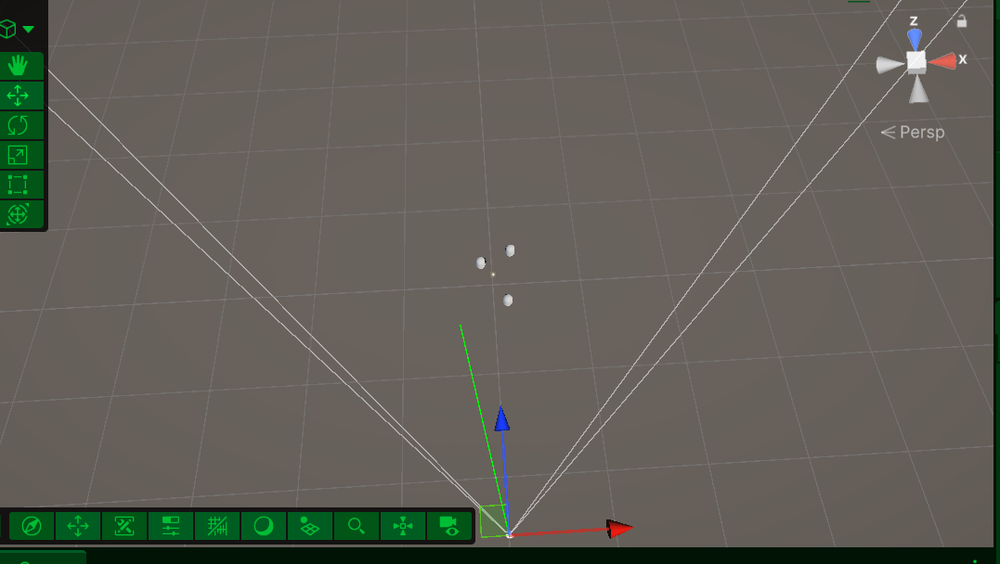

2. 캐릭터 선택 시 빨간 색 기즈모 생성

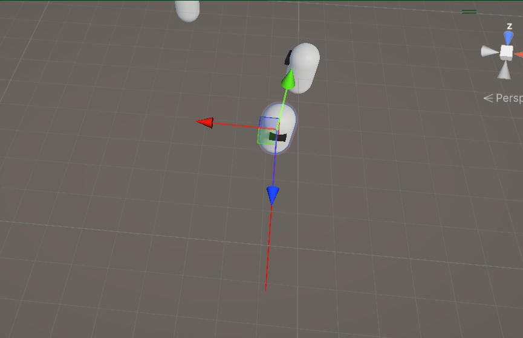

## 9. Layer

### 개념
1. 유니티에서 Layer는 오브젝트를 종류별로 나누는 “분류표”
2. 대표적 예시
    ```
    Player Layer
    Enemy Layer
    Ground Layer
    Wall Layer
    Item Layer
    ```

### Layer를 쓰는 이유

1. 감지하고 싶은 것만 감지하고 싶을 때
```csharp
[SerializeField] private LayerMask _targetLayer;
if (Physics.Raycast(ray, out hit, 10f, _targetLayer))
{
    Debug.Log(hit.transform.name);
}
```
-> _targetLayer에 포함된 Layer만 Raycast에 걸림.

### LayerMask

1. LayerMask는 “감지할 Layer 목록”

2. [SerializeField] private LayerMask _targetLayer;
-> Inspector에서 체크박스로 Layer를 선택할 수 있습니다.

3. Inspector에서 Enemy만 체크하면 Raycast는 Enemy만 감지.

4. Physics.Raycast(ray, out hit, distance, layerMask);
-> ray 방향으로 distance만큼 쏘고, layerMask에 포함된 Layer만 감지.

### Layer 사용 순서
1. Unity 상단 또는 Inspector에서 Layer 추가
2. 오브젝트에 Layer 지정
3. 스크립트에 LayerMask 변수 만들기
4. Inspector에서 감지할 Layer 체크
5. Raycast에 LayerMask 넣기

### Raycast와 Tag
- Raycast: Ray가 어떤 오브젝트를 맞췄는지 찾는 기능
- Tag: 맞은 오브젝트가 어떤건지 구분하는 이름표

### Raycast와 LayerMask
- Raycast: Ray가 어떤 오브젝트를 맞췄는지 찾는 기능
- Layer: Tag와 비슷하게 이름 넣지만 개별 이름이 적용된 Tag를 그룹화해 대분류 하는 기능
- Layer 예시: 적, 벽, 총알 등을 각각 큰 그룹으로 나누고 Tag는 Layer로 그룹화된 Enemy에서 각각 개별 이름을 붙여서 종류별로 Enemy를 나눕니다.

### Tag와 Layer 차이점
- Tag: 개별이름, 오브젝트에게 정체성 부여, 오브젝트에 정보 확인(“이 오브젝트가 누구인지” 검사)
- Layer: 특징이 같은 개별이름을 넣을 오브젝트를 그룹화해 크게 분류, 시스템 분류(UI, Ground, Wall, Enemy), 어떤 특정 오브젝트들을 볼 것인지 충돌하거나 검사 할 것인지 결정(“Raycast나 충돌 검사에서 감지할지 말지” 결정)

### 특정 Layer만 감지 대상에서 무시하고 싶을 때
    ```
    int playerLayer = LayerMask.GetMask("Player");
    int layerMask = ~playerLayer;

    Physics.Raycast(ray, out hit, 10f, layerMask);
    ```
~: Player만 제외하고 나머지 전부 감지

### 사용 시 주의점

1. 캐릭터 프리랩에 자식으로 되어있는 프리팹 중에 Collider가 있으면 그 프리팹에 Layer가 있어야 Raycast가 캐릭터를 감지 할 수 있습니다.

2. Raycast는 Collider가 있어야 감지.

3. LayerMask에 아무 Layer도 체크하지 않으면 아무것도 감지하지 못함.

## LayerMask 실습 1

- LayerMask는 구조체로 선언되어 있으며 내부에는 레이어의 값과 레이어를 반환 받기 위한 static 메서드 존재

- 오브젝트를 생성하서 오브젝트 마다 Layer 이름 생성 및 적용

```csharp
using UnityEngine;

// 마우스를 클릭한 오브젝트에 Ray를 쏴서
// 특정 Layer에 있는 오브젝트만 감지하는 스크립트
public class RaycastController : MonoBehaviour
{
    // 메인 카메라를 저장할 변수
    // ScreenPointToRay를 사용하려면 Camera가 필요함
    private Camera _cam;

    // Ray가 날아갈 최대 거리
    [SerializeField] private float _rayDistance;

    // Raycast가 감지할 Layer 목록
    [SerializeField] private LayerMask _detectionLayer;

    private void Awake()
    {
        Init();
    }

    private void Update()
    {
        // 마우스 왼쪽 버튼을 누른 순간에만 실행
        // GetMouseButtonDown(0) = 누른 첫 프레임만 true
        // GetMouseButton(0) = 누르고 있는 동안 계속 true
        if (Input.GetMouseButtonDown(0))
        {
            // Ray 발사 함수 호출
            RayShot();
        }
    }

    // Raycast를 실행하는 함수
    private void RayShot()
    {
        // 마우스의 화면 좌표를 기준으로 Ray 생성
        // Input.mousePosition = 현재 마우스 위치
        // ScreenPointToRay = 화면 좌표를 월드 공간 Ray로 변환
        Ray ray = _cam.ScreenPointToRay(Input.mousePosition);

        // Ray에 맞은 오브젝트 정보를 저장할 변수
        RaycastHit hit;

        // Raycast 실행
        // ray : 발사할 Ray
        // out hit : 맞은 오브젝트 정보를 hit에 저장
        // _rayDistance : Ray 최대 거리
        // _detectionLayer : 감지할 Layer만 필터링
        if (Physics.Raycast(ray, out hit, _rayDistance, _detectionLayer))
        {
            // Ray에 맞은 오브젝트 이름 출력
            Debug.Log(hit.transform.name);
        }
    }

    private void Init()
    {
        // MainCamera 태그가 붙은 카메라를 찾아서 저장
        _cam = Camera.main;
    }
}
```
- 결과

1. 감지할 Layer 이름만 체크 시 체크 되어있는 오브젝트에게 마우스 죄클릭 하면 그 오브젝트 Layer 이름이 호출

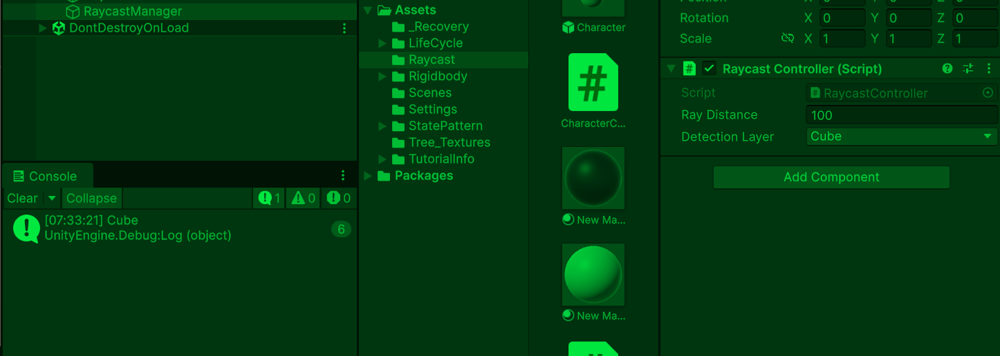

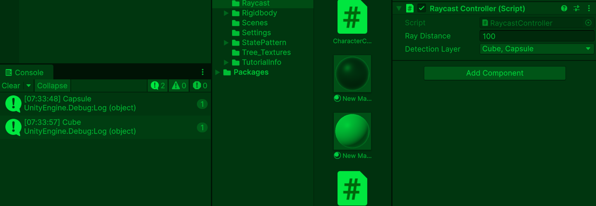

## Raycast 종합 실습 1: 기즈모를 쏴서 맞닿은 오브젝트와의 감지 거리와, 감지 좌표 표시

```csharp
using UnityEngine;

public class RaycastStudy : MonoBehaviour
{
    // Ray가 감지할 최대 거리
    [SerializeField] private float _rayLength;

    // Ray 정보를 저장하는 변수
    // Ray의 시작 위치(origin)와 방향(direction)을 가지고 있음
    private Ray _ray;

    private void Update()
    {
        // 매 프레임 Raycast 실행
        RayShot();
    }

    private void OnDrawGizmos()
    {
        // 기즈모 색상을 노란색으로 설정
        Gizmos.color = Color.yellow;

        // Ray를 Scene 뷰에 선으로 그림
        // _ray.origin : Ray 시작 위치
        // _ray.direction : Ray 방향
        // _rayLength : Ray 길이
        Gizmos.DrawRay(_ray.origin, _ray.direction * _rayLength);
    }

    private void RayShot()
    {
        // 현재 오브젝트 위치에서 현재 오브젝트의 앞 방향으로 Ray 생성
        // transform.position : Ray 시작 위치
        // transform.forward : 오브젝트가 바라보는 앞 방향
        _ray = new Ray(transform.position, transform.forward);

        // Raycast에 맞은 오브젝트 정보를 저장할 변수
        RaycastHit hit;

        // Raycast 실행
        // _ray : 발사할 Ray
        // out hit : 맞은 오브젝트 정보를 hit에 저장
        // _rayLength : Ray가 날아갈 최대 거리
        if (Physics.Raycast(_ray, out hit, _rayLength))
        {
            // Ray에 감지된 오브젝트 이름, 거리, 감지 좌표 출력
            Debug.Log($"{hit.transform.name} 감지, 거리: {hit.distance}, 감지 좌표: {hit.point}");
        }
    }
}
```

- 결과

1. 기즈모를 5를 설정 했을 때 기즈모가 쏘는 5의 거리안에 다른 오브젝트와 맞닿으고 거리를 좁히거나 맞추면 5 이하의 거리와 감지 좌표가 호출.

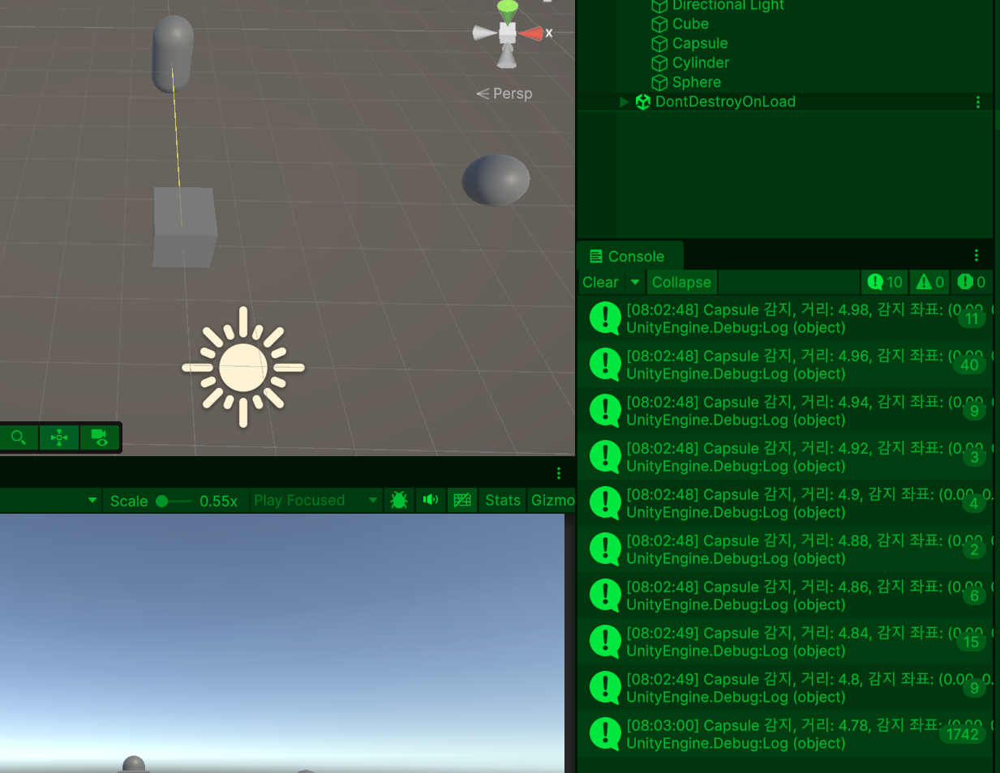

## Raycast 종합 실습 2: 캐릭터와 카메라 사이에 장애물이 있는지 Raycast로 검사하고 캐릭터에 카메라가 이동하여 플레이어를 보이게함. 

```csharp
using UnityEngine;

public class RaycastStudy : MonoBehaviour
{
    // Ray가 감지할 레이어 마스크
    [SerializeField] private LayerMask _targetLayer; 
    // Ray가 감지할 최대 거리
    [SerializeField] private float _rayLength;

    // Ray 정보를 저장하는 변수
    // Ray의 시작 위치(origin)와 방향(direction)을 가지고 있음
    private Ray _ray;

    private void Update()
    {
        // 매 프레임 Raycast 실행
        RayShot();
    }

    private void OnDrawGizmos()
    {
        // 기즈모 색상을 노란색으로 설정
        Gizmos.color = Color.yellow;

        // Ray를 Scene 뷰에 선으로 그림
        // _ray.origin : Ray 시작 위치
        // _ray.direction : Ray 방향
        // _rayLength : Ray 길이
        Gizmos.DrawRay(_ray.origin, _ray.direction * _rayLength);
    }

    private void RayShot()
    {
        // 현재 오브젝트 위치에서 현재 오브젝트의 앞 방향으로 Ray 생성
        // transform.position : Ray 시작 위치
        // transform.forward : 오브젝트가 바라보는 앞 방향
        _ray = new Ray(transform.position, transform.forward);

        // Raycast에 맞은 오브젝트 정보를 저장할 변수
        RaycastHit hit;

        // Raycast 실행
        // _ray : 발사할 Ray
        // out hit : 맞은 오브젝트 정보를 hit에 저장
        // _rayLength : Ray가 날아갈 최대 거리
        // _targetLayer: 감지할 Layer
        if (Physics.Raycast(_ray, out hit, _rayLength, _targetLayer))
        {
            // Ray에 감지된 오브젝트 이름, 거리, 감지 좌표 출력
            Debug.Log($"{hit.transform.name} 감지, 거리: {hit.distance}, 감지 좌표: {hit.point}");
        }
    }
}
```

- 결과

1. Layer 이름이 Map 오브젝트만 감지

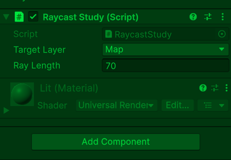

2. Capsule 오브젝트의 Layer이름이 Enemy이므로 디버그 호출 안됨.

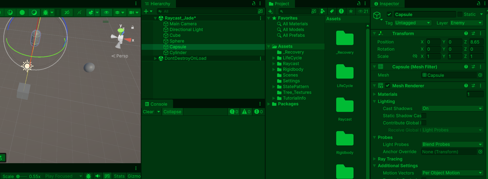

3. Cylinder 오브젝트의 Layer이름이 Map이르모 디버그 호출

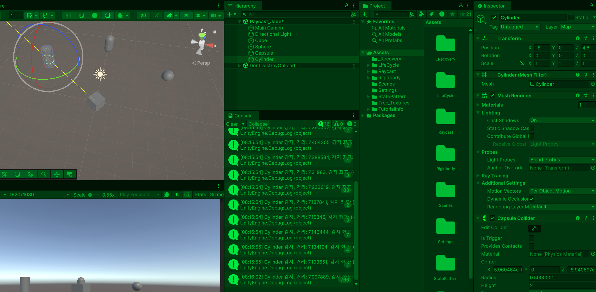

## 

- Lerp로 구현하여 Camera가 오브젝트 따라가는데 부자연스러움

## 개인 Raycast 실습 1: 마우스로 클릭하여 Raycast 쏘기

```csharp
using UnityEngine;

// 마우스 클릭한 위치로 Raycast 쏘기
public class MousRaycastTest : MonoBehaviour
{
    // 메인 카메라 저장용 변수
    private Camera _cam;

    // Ray가 날아갈 최대 거리
    [SerializeField] private float _rayDistance;

    // 기즈모에서 사용할 Ray 저장 변수
    private Ray _ray;

    private void Awake()
    {
        // MainCamera 태그가 붙은 카메라 가져오기
        _cam = Camera.main;
    }

    private void Update()
    {
        // 마우스 왼쪽 버튼을 누른 순간 1번만 실행
        if (Input.GetMouseButtonDown(0))
        {
            ShotRay();
        }
    }

    private void OnDrawGizmos()
    {
        Gizmos.color = Color.green;

        // _ray.origin : Ray 시작 위치
        // _ray.direction : Ray 방향
        Gizmos.DrawRay(_ray.origin, _ray.direction * _rayDistance);
    }

    private void ShotRay()
    {
        // 마우스 위치를 기준으로 Ray 생성
        _ray = _cam.ScreenPointToRay(Input.mousePosition);

        // Raycast에 맞은 오브젝트 정보를 저장할 변수
        RaycastHit hit;

        // Raycast 실행
        // _ray : 발사할 Ray
        // out hit : 맞은 오브젝트 정보를 hit에 저장
        // _rayLength : Ray가 날아갈 최대 거리
        if (Physics.Raycast(_ray, out hit, _rayDistance))
        {
            Debug.Log($"클릭한 오브젝트: {hit.transform.name}");
        }
    }
}
```

- 결과

1. 마우스 한 번 클릭한 위치에 기즈모가 생성되고 Collider가 있는 오브젝트를 마우스 좌클릭하면 기즈모가 닿아 감지하면 오브젝트 정보에 대해 디버그 호출
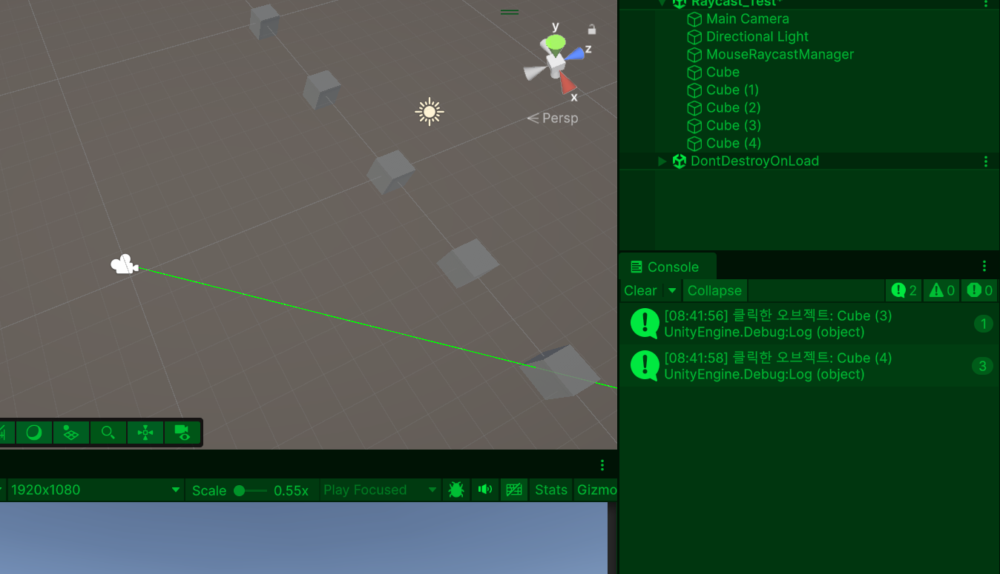

### 개인 Raycast 실습 2: 오브젝트 생성 후 Raycast로 다른 오브젝트 감지하기

```csharp
using UnityEngine;

public class SceneObjectRaycastTest : MonoBehaviour
{
    // Ray가 감지할 최대 거리
    [SerializeField] private float _rayDistance;

    // Ray 정보를 저장하는 변수
    // OnDrawGizmos와 Raycast에서 같이 사용
    private Ray _ray;

    private void Update()
    {
        // 매 프레임 Raycast 실행
        ShootRayFromThisObject();
    }

    private void OnDrawGizmos()
    {
        Gizmos.color = Color.yellow;

        // 이 오브젝트의 현재 위치에서 앞 방향으로 Ray 기즈모 표시
        Gizmos.DrawRay(
            transform.position,
            transform.forward * _rayDistance
        );
    }

    private void ShootRayFromThisObject()
    {
        // 이 스크립트가 붙은 오브젝트의 위치에서
        // 이 오브젝트가 바라보는 앞 방향으로 Ray 생성
        _ray = new Ray(transform.position, transform.forward);

        // Ray에 맞은 오브젝트 정보를 저장할 변수
        RaycastHit hit;

        // Raycast 실행
        // _rayDistance 거리 안에 Collider가 있으면 true
        if (Physics.Raycast(_ray, out hit, _rayDistance))
        {
            // 감지된 오브젝트 이름 출력
            Debug.Log($"{name}가 {hit.transform.name} 감지!");
        }
    }
}
```

- 결과
1. SceneObjectRaycastTest.cs가 있는 오브젝트에서 기즈모 거리를 조절하여 쏘게 한 후 다른 Collider가 있는 오브젝트에 기즈모가 닿으면 Ray가 감지하여 디버그 호출 Collider가 없을 시 Ray가 감지 못하여 디버그 호출이 안됨.

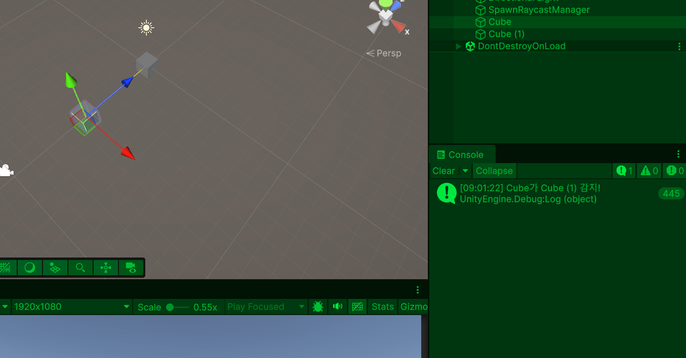

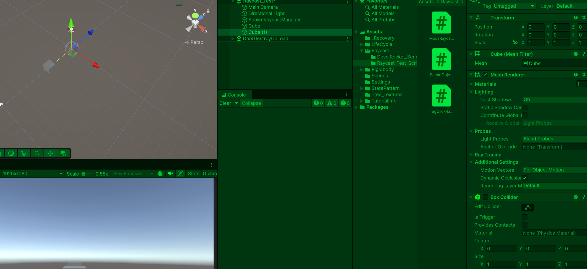

### 개인 Raycast 실습 3: 원하는 태그의 오브젝트를 클릭했을 때만 로그 출력하기

```csharp
using UnityEngine;

public class TagClickRaycastTest : MonoBehaviour
{
    // 메인 카메라를 저장할 변수
    // Camera.main은 MainCamera 태그가 붙은 카메라를 찾음
    private Camera _cam;

    // Ray가 날아갈 최대 거리
    [SerializeField] private float _rayDistance;

    // 감지하고 싶은 태그 이름
    [SerializeField] private string _targetTag;

    // Ray를 저장하는 변수
    // OnDrawGizmos에서 Ray를 시각화하기 위해 필요
    private Ray _ray;

    // Ray가 한 번이라도 생성되었는지 확인하는 변수
    // false면 아직 클릭한 적이 없다는 뜻
    private bool _hasRay;

    private void Awake()
    {
        // 씬에서 MainCamera 태그가 붙은 카메라를 찾아 저장
        _cam = Camera.main;
    }

    private void Update()
    {
        // 마우스 왼쪽 버튼을 누른 첫 프레임에만 true
        // 클릭 한 번당 Raycast 한 번 실행
        if (Input.GetMouseButtonDown(0))
        {
            // Raycast 실행 함수 호출
            ShootRayAndCheckTag();
        }
    }

    private void OnDrawGizmos()
    {
        // 아직 Ray가 생성된 적이 없으면 그릴 Ray가 없으므로 종료
        if (!_hasRay)
        {
            return;
        }

        // 기즈모 색상을 초록색으로 설정
        Gizmos.color = Color.green;

        // 마지막으로 클릭했을 때의 Ray를 Scene 뷰에 그림
        // _ray.origin : Ray 시작 위치
        // _ray.direction : Ray 방향
        // _rayDistance : Ray 길이
        Gizmos.DrawRay(_ray.origin, _ray.direction * _rayDistance);
    }

    // 마우스 클릭 위치로 Raycast를 쏘고 태그를 검사하는 함수
    private void ShootRayAndCheckTag()
    {
        // 마우스 위치를 기준으로 카메라에서 Ray 생성
        // Input.mousePosition : 현재 마우스의 화면 좌표
        // ScreenPointToRay : 화면 좌표를 월드 공간 Ray로 변환
        _ray = _cam.ScreenPointToRay(Input.mousePosition);

        // Ray가 생성되었으므로 기즈모를 그릴 수 있게 true로 변경
        _hasRay = true;

        // Raycast에 맞은 오브젝트 정보를 저장할 변수
        RaycastHit hit;

        // Raycast 실행
        // _ray : 발사할 Ray
        // out hit : 맞은 오브젝트 정보 저장
        // _rayDistance : Ray 최대 거리
        if (Physics.Raycast(_ray, out hit, _rayDistance))
        {
            // Ray가 무언가를 감지했을 때 무조건 출력
            // 디버그 확인용 로그
            Debug.Log($"클릭 감지됨: {hit.transform.name}, 태그: {hit.transform.tag}");

            // 클릭한 오브젝트의 태그가 원하는 태그인지 검사
            if (hit.transform.CompareTag(_targetTag))
            {
                // 원하는 태그일 때만 출력
                Debug.Log($"원하는 태그 오브젝트 클릭: {hit.transform.name}, 태그: {hit.transform.tag}");
            }
        }
    }
}
```

- 결과

1. 감지할 Tag를 Enemy로 설정 후 Enemy Tag가 있는 오브젝트를 클릭하면 기즈모가 그 오브젝트에 들어가 ray가 감지하여 '원하는 태크 오브젝트 클릭'이라는 디버그 호출

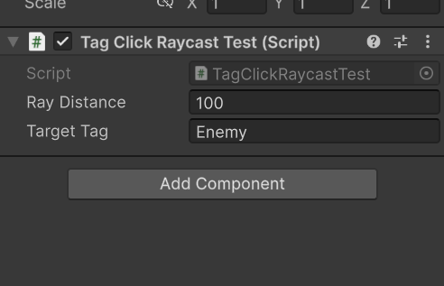

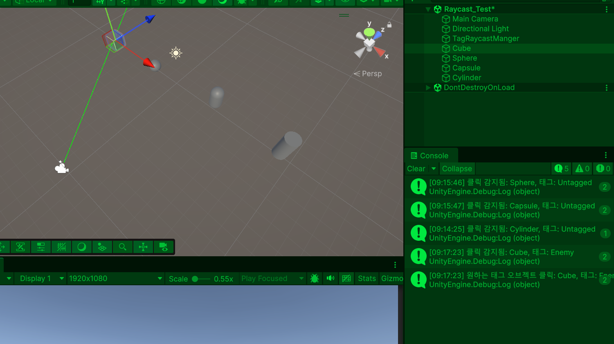


