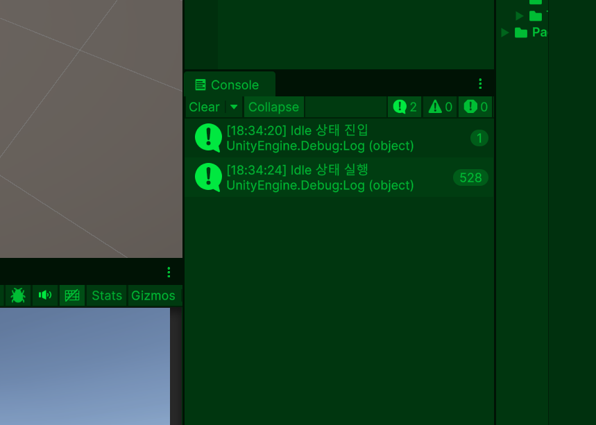
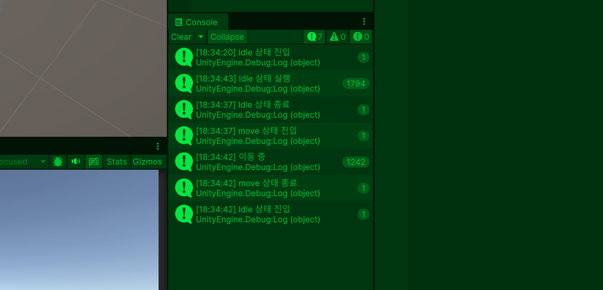

# 상태패턴(StatePattern)

## 1. 개념
1. 객체의 현재 상태에 따라 다른 코드(기능)를 실행하는 구조
2. 상태에 따라 기능이 호출될 클래스를 각각 생성해 가독성을 좋게하여 호출이 되게함.

## 2. 작동 예시
1. 점프를 입력 시 플레이어가 점프 클래서 점프관련 코드 호출

## 3. 특징
1. 상태분리: 상태마다 클래스를 나눔
2. 길게 if, switch와 같은 조건문을 써서 길게 코드를 안짜고 간결히 짤 수 있습니다.
3. 확장 쉬움: 추가 하고 싶은 상태 기능을 편하게 추가
4. 유지보수 좋음: 수정 범위 적음
5. 객체지향적: 책임 분리

## 4. 적용 예시
1. 플레이어 상태: 이동, 공격, 사망, 점프 등 
2. 적 AI: 순찰, 추적, 공격, 복귀 등
3. UI 상태: UI 열기, 닫기, 로딩

## 5. 상태패턴 인터페이스

```csharp
public interface IState
{
    void Enter();
    void Update();
    void Exit();
}
```

### 5-1 상태패턴 역할
1. Enter: 상태 진입
2. Update: 상태 실행
3. Exit: 상태 종료

## 6. 인터페이스와 클래스 차이점

### 6-1 인터페이스
1. 인터페이스 구현: 함수 틀만 규칙 정의
2. 상태 패턴 매니저를 만들었으면 그에 대한 규칙 및 클래스를 반드시 구현해야 함
3. 인터페이스를 여러 개 구현 가능
4. 함수 이름만 존재
5. 서로 다른 클래스지만 구조는 통일

### 6-2 MonoBehaviour(클래스)
1. 클래스 상속
2. 상속: MonoBehaviour 기능을 물려 받음
3. 변수, 함수, 구현 코드 존재
4. 클래스 상속은 1개만 가능
5. 공통 기능 재상용이 목적


## 7. 상태패턴 실습

### 7-1 상태패턴 매니저

```csharp
using Unity.IO.LowLevel.Unsafe;
using Unity.VisualScripting;
using UnityEngine;
using UnityEngine.InputSystem;
using UnityEngine.XR;

// 상태 인터페이스
// 모든 상태(IdleState, MoveState 등) 함수 정의
public interface IState
{
    // 상태 진입 시 호출
    // 상태 시작 초기화 작업
    void Enter();

    // 상태 실행 중 반복 호출
    // 상태 메인 로직
    void Update();

    // 상태 종료 시 호출
    // 상태 정리 작업
    void Exit();
}

public class StateManager : MonoBehaviour
{
    // IState 인터페이스를 구현한 상태 객체: IdleState, MoveState
    // IdleState 또는 MoveState가 들어감
    private IState currentState;

    // 대기 상태 변수
    private IdleState idleState;
    // 이동 상태 변수
    private MoveState moveState;

    private void Start()
    {
        // 대기 상태 객체 생성
        idleState = new IdleState();
        // 이동 상태 객체 생성
        moveState = new MoveState();

        // 시작 상태를 IdleState로 변경
        // currentState = idleState
        // IdleState.Enter() 호출
        ChangeState(idleState);
    }

    private void Update()
    {
        // 키보드가 존재하고 W 키를 누르고 있는지 확인
        // Keyboard.current: 현재 연결된 키보드 장치
        // Keyboard.current != null: 키보드가 연결되어 있는지 확인
        // Keyboard.current.wKey.isPressed: W 키가 눌려 있는지 확인
        if (Keyboard.current != null && Keyboard.current.wKey.isPressed)
        {
            // 현재 상태가 MoveState가 아닐 때만
            // W 키가 눌려 있으면 MoveState로 변경
            // 상태 중복 변경 방지
            if (currentState != moveState)
            {
                // 현재 상태를 MoveState로 변경
                ChangeState(moveState);
            }
        }
        // W 키가 눌려 있지 않으면 IdleState로 변경
        else
        {
            if (currentState != idleState)
            {
                ChangeState(idleState);
            }
        }

        // currentState가 null이 아니면 실행
        // null: 상태가 없는 경우, 오브젝트가 존재하지 않는 경우
        currentState?.Update();
    }

    public void ChangeState(IState newState)
    {
        // 기존 상태가 존재하면 Exit() 실행
        // 이전 상태 정리 작업
        // 이벤트 해제, 변수 초기화 등
        currentState?.Exit();

        // 새로운 상태로 교체
        currentState = newState;

        // 새로운 상태의 Enter() 실행
        // 공격 시작, 속도 설정, 이동 애니메션 재생 등 초기화 작업
        currentState.Enter();
    }
}
```

### 7-2 Idle 상태(Istate의 인터페이스에 일부)

```csharp
using UnityEngine;

public class IdleState :IState
{
    public void Enter()
    {
        Debug.Log("Idle 상태 진입");
    }

    public void Update()
    {
        Debug.Log("Idle 상태 실행");
    }

    public void Exit()
    {
        Debug.Log("Idle 상태 종료");
    }
}
```

### 7-3 Move 상태(Istate의 인터페이스에 일부)

```csharp
using UnityEngine;

public class MoveState : IState
{
    public void Enter()
    {
        Debug.Log("move 상태 진입");
    }

    public void Update()
    {
        Debug.Log("이동 중");
    }

    public void Exit()
    {
        Debug.Log("move 상태 종료");
    }
}
```

## 8. 상태패턴 실습 결과

### 1. 이동키 W를 누르기 전에 대기 상태 진입 후 상태 실행


### 2. 이동키 W를 누르고 있을 때 Move상태 진입 후 '이동 중' 호출, W를 때면 Move 상태 종료와 함께 대기 상태로 재 진입
