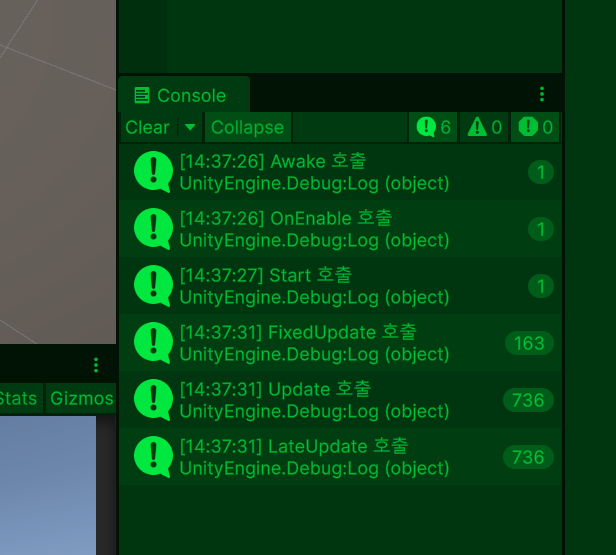
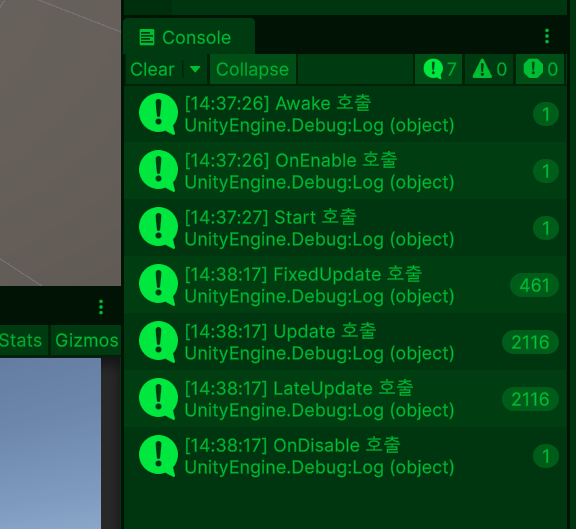
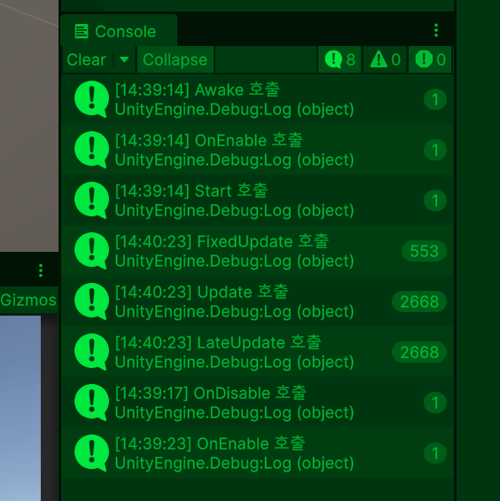
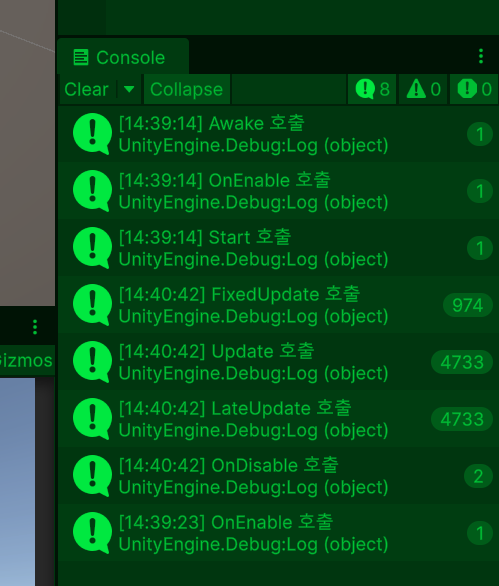
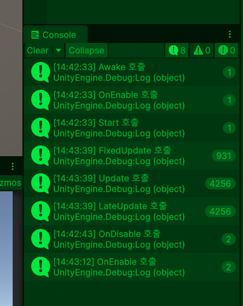
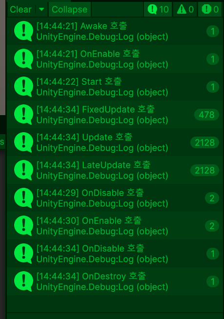
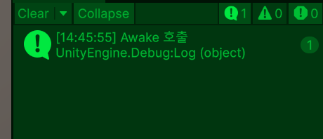
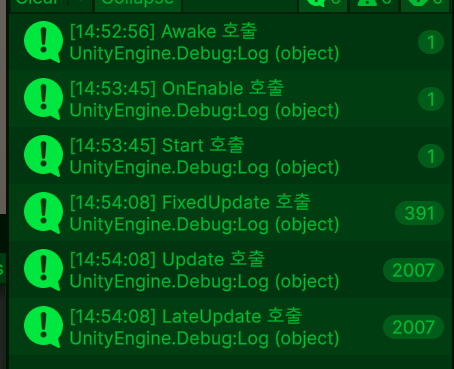
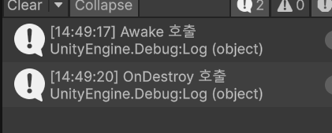

# 1. private와 public 개념과 차이점
- private: 현재 스크립트 내부에서만 사용 가능
- public: 다른 스크립트에서도 접근가능, inspector에도 표시됨

## 1-1 private와 public이 언제 쓰이는지
- private: 내부 계산용, 상태 관리용, 실수로 수정되면 위험한 값
- public: 예를들어 플레이어 능력치 클래스에 접근을 하게하여 언제든 쉽게 수정하고 싶을 때

### 1-2 private를 노출시키되 다른 스크립트 접근 못하게 하는 법
[SerializeField] private float Attack = 5.5f;

## 1-3 public으로 모두 선언 시
1. 코드 관리 어려움
2. 버그 추적 힘듦
3. 외부 수정 위험
4. 캡슐화(필요한 기능만 메서드로 열어주는 방식) 깨짐

## 1-4 public과 private 적절히 활용법
1. 튜닝값: [SerializeField] private
2. 내부 상태: private
3. 외부 공개 함수: public
4. 읽기 전용 정보: public getter

## 1-5 private와 public 요약
- private는 다른 스크립트가 접근하여 바뀌면 안돼는 값에 적용하지만 inspector에 노출하고 싶으면 [SerializeField]사용, public은 다른 스크립트가 접근하여 데이터 값이 수정되거나 추가되기 위해 사용


# 2. 라이프 사이클

## 2-1 개념
- 오브젝트와 스크립트가 언제 어떤 순서로 실행되는지를 의미합니다

## 2-2 라이프 사이클 핵심 함수 순서도
- Awake() -> OnEnable() -> Reset() -> Start() -> Physics(FixedUpdate(), OnTrigger(), OnCollision() 등 물리충돌) -> OnMouseXXX -> GameLogic(Update(), LateUpdate(), 프레임 마다 호출 되는 코루티, 애니메이션 등 동작 및 기능) -> Scene Rendering(랜더링, 시각적 이미지 등 씬에서 보여지는 것) -> Gizmo Rendering(OnDrawGizmos(), 기즈모, 감지 기능) -> GUI Rendering(OnGUI, UI 관련 인터페이스) -> End Of Frame(yield WaitForEndOfFrame(), 코루틴 로직 종료점) -> Pausing(OnApplicationPause(), 모든 기능 로직 중지 전 단계) -> Decommissioning(OnApplicationQuit(), OnDisable(), OnDestroy(), 모든 기능 로직 종료 단계)

- yield return new WaitForFixedUpdate()를 사용하면 코루틴은 다음 FixedUpdate까지 대기한다. while문과 함께 사용하면 코루틴이 매 FixedUpdate마다 반복 실행.
- OnApplicationPause()는 앱이 일시정지되거나 재개될 때 호출되는 콜백이며, 재개되면 다시 FixedUpdate에서 Update 게임 로직이 수행되고, 종료되면 종료 단계(OnApplicationQuit)로 진행.

## 2-3 각 함수 별 개념
- Awake
1. 오브젝트 생성 직후 실행
2. 비활성 상태여도 실행 가능
3. 자기 자신 초기화
4. Rigidbody 가져오기
5. Animator 가져오기
6. AudioSource 가져오기
7. 싱글톤 Instance 등록
8. 배열/리스트 초기화

- OnEnable()
1. 오브젝트가 활성화될 때 마다 1번 호출
2. Update() 이전에 호출

- Start()
1. Awake() 이후 오브젝트 생성 및 활성화 시 단 1번 호출
2. 다른 오브젝트와 연결 후 시작 준비
3. UI 초기 값 반영
4. GameManager 데이터 가져오기
5. 플레이어 위치 참조
6. 시작 연출 실행

- OnMouseXXX()
1. 마우스로 오브젝트를 클릭하거나, 올리거나, 떼는 등의 이벤트가 발생했을 때 Unity가 자동으로 호출하는 콜백 함수.

- Update()
1. 매 프레임 마다 호출(초당 60~300이상 가능)
2. 입력 처리
3. 오브젝트와 스크립트의 생존 및 활성화 시에만 작동
4. 실시간 계산 및 데이터 호출
5. 입력/일반 로직

- FixedUpdate()
1. 물리 전용 업데이트
2. Rigidbody 물리 계산용
3. 고정 시간, 고정 횟수로 매 프레임 호출(기본 1초에 약 50번)

- LateUpdate()
1. 모든 Update 끝난 뒤 실행
2. 플레이어 카메라 추적에 사용

- OnDisable()
1. 비활성화 시 1회 호출
2. Update() 이후 호출
3. 주로 이벤트 해제 이용

- OnDestroy()
1. 오브젝트 삭제 시 1회 호출

## 2-4 라이프 사이클 실습 코드

```csharp
using UnityEngine;

public class LifeCycle : MonoBehaviour
{
    private void Awake()
    {
        Debug.Log("Awake 호출");
    }
    
    private void OnEnable()
    {
        Debug.Log("OnEnable 호출");
    }

    private void Start()
    {
        Debug.Log("Start 호출");
    }

    private void FixedUpdate()
    {
        Debug.Log("FixedUpdate 호출");
    }

    private void Update()
    {
        Debug.Log("Update 호출");
        Debug.Log("Update 호출");
    }

    private void LateUpdate()
    {
        Debug.Log("LateUpdate 호출");
    }

    private void OnDisable()
    {
        Debug.Log("OnDisable 호출");
    }

    private void OnDestroy()
    {
        Debug.Log("OnDestroy 호출");
    }
}
```
## 2-5 라이프 사이클 실습 결과
1. 처음에 오브젝트 및 스크립트 비활성화 안하고 실행


2. 유니티 재생 중 오브젝트 비활성화: OnDisable()이 호출되고 디버그가 멈춥니다.


3. 유니티 재생 중 다시 오브젝트 활성화: OnEnable()이 호출되고 Update()가 매 프레임 마다 호출됩니다.


4. 유니티 재생 중 스크립트만 비활성화: 오브젝트 비활성화 처럼 OnDisable()만 호출되고 Update() 호출이 멈춥니다.


5. 유니티 재생 중 다시 스크립트 활성화: OnEnable()이 호출되고 Update()가 매 프레임 마다 호출됩니다.


6. 유니티 재생 중 라이프 사이클 스크립트가 있는 오브젝트 삭제: OnDisable()이 먼저 호출되고 그 다음 OnDestory()이 호출됩니다.



7. 오브젝트에 스크립트만 비활성화 하고 실행: Awake()만 호출됩니다.


8. 오브젝트에 스크립트만 비활성화 하고 실행 중 스크립트 활성화


9. 오브젝트에 스크립트만 비활성화 하고 실행하고 중단 및 삭제 시: OnDestroy() 호출됩니다.


10. 오브젝트를 비활성화: 아무것도 디버그 호출이 안됩니다.

## 2-6 FixedUpdate(), Update(), LateUpdate() 요약
1. FixedUpdate()는 물리 엔진 힘을 매 프레임마다 나타내는 것으로 매 초마다 프레임이 높으면 물리 엔진이 무거워져 cpu 수명, 발열 등에 컴퓨터 성능 저하가 일어나므로 매 프레임 값을 낮췄고, 프레임이 고정인 이유는 컴퓨터 성능의 따라 물리 결과가 달라져 컴퓨터 돌아가는 속도에 달라집니다. 그래서 매 프레임 값을 고정하여 적당한 컴퓨터 속도를 줍니다.
2. Update()와 LateUpdate()가 매 프레임 호출이 같은 이유는 LateUpdate()는 플레이어가 이동이하거나 공격 등을 할 때 카메라 추적합니다. 그래서 이를 자연스럽게 할려면 Update() 바로 뒤에 호출되며 매 프레임이 동일한 값으로 호출됩니다.

# 3. InputAcion

## 3-1 개념
- 입력을 하나의 행동(Action)으로 추상화
- 스크립트로 Input.GetKeyDown(KeyCode.Space)의 형식 대신 유니티 엔진에서 제공하는 툴로 설정하여 이동이나 입력 제어 및 컨트롤 가능

## 3-2 설정 및 시스템 요소
- InputAction
1. 입력을 "행동 단위"로 관리하는 시스템

- Action Map
1. 행동 그룹

- Binding
1. 실제 키 연결

## 3-3 start, performed, canceled란?
1. started: 입력 시작
2. performed: 실제 실행
3. canceled: 입력 종료

## 3-4 종류
1. Send Messages: 문자열 함수 자동 호출
2. Broadcast Messages: 부모/자식까지 호출
3. Invoke Unity Events: Inspector 이벤트 연결
4. Invoke C Sharp Events: 코드 이벤트 방식

## 3-5 Invoke Unity Events 개념
- Inspector에서 버튼 연결하듯 입력 연결
- 코드 직접 연결 X
- Inspector에서 함수 연결

### 3-6 Invoke Unity Events 동작 순서
- Space 입력 -> PlayerInput -> Jump 이벤트 발생 -> Inspector에 연결된 함수 실행

### 3-7 Invoke Unity Events와 Invoke C Sharp Events 차이점
- Invoke Unity Events
1. Inspector에서 연결
2. 시각적 잘 보여서 쉬움
3. 연결 많아지면 관리 힘듦

- Invoke C Sharp Events
1. 코드에서 이벤트 연결
2. 코드 관리 쉬움
3. 숙련자 전용

# 4. Impulse와 Force
- Impulse
1. 순간적으로 강한 힘을 한 번 가하는 방식
2. 점프, 총 반동, 폭발, 총알 발사, 넉백 등의 기능 구현 할때 사용
3. 질량 영향 받음
4. 계속 누적

- Force
1. 계속 힘 주는 느낌
2. 엔진 추진, 바람, 자동차 가속 등의 기능 구현 할때 사용
3. 질량 무시
4. 한 프레임 순간 적용

## 참고 자료

- 라이프 사이클
1. https://docs.unity3d.com/kr/2019.4/Manual/ExecutionOrder.html