# Collision과 Trigger 개념

1. Collision (충돌)
2. Trigger (감지)

## Collision (충돌, 막힘)

### 1. 개념

- 활성화 된 오브젝트 간의 충돌처리에 사용

- 예시:
    1. 벽에 막힘
    2. 바닥에 떨어짐
    3. 공 튕김
    4. 자동차 충돌

### 2. 특징 

1. 플레이어가 벽을 통과 못함.
2. 물리 엔진 사용: Rigidbody + Collider 기반
3. 힘, 반동, 마찰 적용 가능: 튕김, 밀림, 중력, 마찰

4. 충돌 이벤트 함수 사용

    대표 함수:
    ```csharp
    OnCollisionEnter()
    OnCollisionStay()
    OnCollisionExit()
    ```

---

### 3. Collision 작동 흐름

- 오브젝트 간 접촉 -> 각 오브젝트 Collider 감지 -> 물리 충돌 계산 -> 충돌 반응 발생 -> OnCollisionEnter 호출

    ```csharp
    private void OnCollisionEnter(Collision collision)
    {
        Debug.Log("충돌 발생");
    }
    ```

### 4. 오브젝트 충돌처리 조건

1. Collider: 필요        
2. Rigidbody: 각 오브젝트에 필요       
3. Is Trigger: 체크 해제 

### 5. Collision 함수 종류

- OnCollisionEnter: 처음 충돌
- OnCollisionStay: 충돌 중
- OnCollisionExit: 충돌 종료

## Trigger (영역 감지)

### 1. 개념

- IsTrigger 선택시 해당 오브젝트는 물리적인 충돌이 진행되지 않고 통과
- 물리 충돌 없이 겹침만 감지
- 물체간에 통과는 가능하지만 감지는 됨

### 2. 특징

1. 오브젝트 통과 가능

2. 물리 반응 없음
    * 튕기지 않음
    * 밀리지 않음
    * 막히지 않음

3. 영역 감지에 특화
    * 아이템 획득
    * 몬스터 탐지: 플레이어 들어오면 공격 시작
    * 특정 영역 진입 시 문 닫힘
    * 목표지점 도달
    * Npc와 대화

4. Trigger 이벤트 함수 사용
    
    대표 함수:
    ```csharp
    OnTriggerEnter()
    OnTriggerStay()
    OnTriggerExit()
    ```

### 3. Trigger 작동 흐름

오브젝트 이동 -> Trigger 영역 겹침 -> 물리 충돌 없음 -> OnTriggerEnter 호출

    ```csharp
    private void OnTriggerEnter(Collider other)
    {
    
    }
    ---

### 4.Trigger에 필요한 조건

- Collider : 필요
- Rigidbody : 각 오브젝트에 필요
- Is Trigger : 한 오브젝트 또는 충돌 하는 오브젝트 끼리 Is Trigger 체크 필요

### 5. Trigger 함수 종류

- OnTriggerEnter: 처음 들어감
- OnTriggerStay: 영역 안에 있음
- OnTriggerExit: 영역 나감

### 6. Collider에서 Is Trigger 체크

- 두 오브젝트 Is Trigger OFF: 일반 충돌(Collision), 벽 제작 시 사용
    ```csharp
    OnCollisionEnter()
    OnCollisionStay()
    OnCollisionExit()
    ```

- 한쪽만 Is Trigger ON: 감지, 한쪽 플레이어만 문 통과, 아이템 감지 범위 및 획득, 적 감지, 플레이어(물리충돌) + 적(감지)
    ```csharp
    OnTriggerEnter()
    OnTriggerStay()
    OnTriggerExit()
    ```

- 둘다 Is Trigger ON: Trigger 이벤트 발생, 두 오브젝트간에 통과가능, 스킬 범위끼리 겹침 검사, 적 끼리 감지 범위 체크
    ```csharp
    OnTriggerEnter()
    ```

## Collision vs Trigger 공통점

1. 둘다 Collider 필요
2. Rigidbody 필요: 오브젝트에 보통 둘 중 하나 필요
3. 이벤트 함수 존재: Enter / Stay / Exit
4. 충돌 판정 사용: 물리 엔진 기반 감지
5. 레이어 충돌 설정 영향 받음: Layer Collision Matrix 사용

## Collision vs Trigger 차이점

### 1. Collision
- 실제 충돌: O
- 통과 가능: X
- 물리 반응: O
- 튕김/밀림: O
- Is Trigger 체크: OFF
- 목적: 물리 충돌

### 2. Trigger
- 실제 충돌: X
- 통과 가능: O
- 물리 반응: X
- 튕김/밀림: X
- Is Trigger 체크: ON, 하나 이상의 오브젝트에 체크 필요
- 목적: 물리 충돌

## Collision, Trigger, Kinematic

## Collision 실습 1

```csharp
using UnityEngine;

// Collision: 필드로 gameObject와 transform을 확인 -> gameObject 프로퍼티를 참조해서 태그를 호출하는 것 가능
public class CollisionTest : MonoBehaviour
{
    // 다른 Collider와 처음 충돌했을 때 1번 호출
    private void OnCollisionEnter(Collision other)
    {
        // 충돌한 상대 오브젝트의 Tag가 Player인지 확인
        if (other.gameObject.tag == "Player")
        {
            // Player와 처음 닿았을 때 Console에 로그 출력
            Debug.Log("<color=#fe6857>플레이어와 닿았다.</color>");
        }
    }

    // 다른 Collider와 계속 충돌 중일 때 반복 호출
    private void OnCollisionStay(Collision other)
    {
        // 충돌 중인 상대 오브젝트의 Tag가 Player인지 확인
        if (other.gameObject.tag == "Player")
        {
            // Player와 계속 닿아있는 동안 Console에 계속 로그 출력
            Debug.Log("<color=#fe6857>플레이어와 닿아있다.</color>");
        }
    }

    // 다른 Collider와 충돌이 끝났을 때 1번 호출
    private void OnCollisionExit(Collision other)
    {
        // 충돌이 끝난 상대 오브젝트의 Tag가 Player인지 확인
        if (other.gameObject.tag == "Player")
        {
            // Player와 떨어졌을 때 Console에 로그 출력
            Debug.Log("<color=#fe6857>플레이어와 떨어졌다.</color>");
        }
    }

    // 일정한 시간 간격으로 호출됨
    // Rigidbody 물리 이동, AddForce, 충돌 처리 등 물리 관련 로직에 사용
    private void FixedUpdate()
    {
        // Time.fixedDeltaTime: FixedUpdate가 호출되는 고정 시간 간격
        // 기본값은 보통 0.02초, 초당 약 50번 호출
        Debug.Log($"<color=#ab6cf3>Fixed Update 호출, 이전 호출로부터 {Time.fixedDeltaTime}</color>");
    }

    // 매 프레임마다 호출됨
    // 일반 로직 처리
    private void Update()
    {
        // Time.deltaTime: 이전 프레임과 현재 프레임 사이의 시간
        Debug.Log($"Update 호출, 이전 호출로부터 {Time.deltaTime}");
    }
}
```
### 결과

- 처음에 밀린 물리 계산을 따라잡기 위해 FixedUpdate()를 한 프레임 안에서 여러 번 연속 호출
- 물리 업데이트 시간이 늦어진 상태를 위해 FixedUpdate()를 여러 번 연속 호출

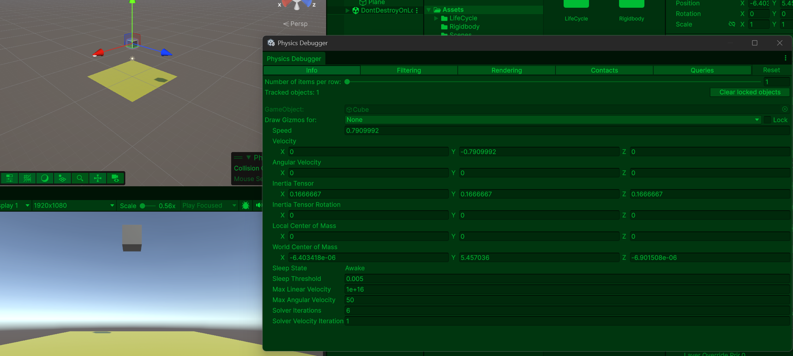

- 어느 정도 물리 계산이 안정화 되면 프레임이 안정화 되면서 FixedUpdate()가 약 0.02초 간격으로 호출


- 오브젝트 끼리 충돌 되었을 때 호출

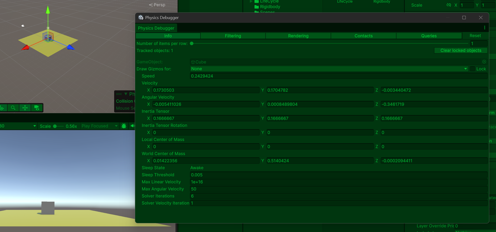

- 오브젝트 끼리 떨어졌을 때 호출

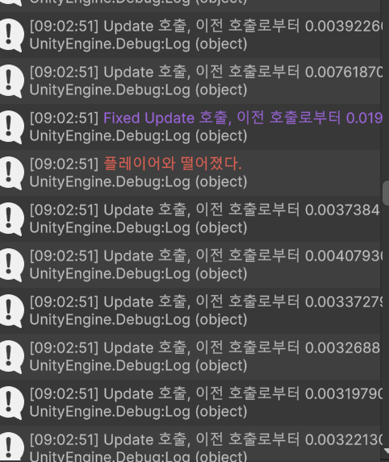

### Collision 실습 2 : 투사체와 Target 오브젝트 충돌

```csharp
using UnityEngine;

public class TargetController : MonoBehaviour
{
    // 최대 피격 횟수
    // 3으로 설정하면 총알을 3번 맞아야 비활성화
    [SerializeField] private int _maxDeactiveCount;

    // 현재 남은 피격 횟수
    private int _currentDeactCount;

    // 제일 먼저 초기화 함수 호출
    private void Awake()
    {
        // 초기화 함수 호출
        Init();
    }

    // 다른 Collider와 처음 충돌했을 때 호출
    private void OnCollisionEnter(Collision other)
    {
        // 충돌한 상대 오브젝트의 Tag가 PlayerBullet인지 확인
        if (other.gameObject.tag == "PlayerBullet")
        {
            // PlayerBullet과 충돌했다면 데미지 처리
            TakeDamage();
        }
    }

    // 최대 피격 횟수를 현재 피격 횟수에 복사함
    private void Init()
    {
        _currentDeactCount = _maxDeactiveCount;
    }

    // 데미지를 받는 함수
    private void TakeDamage()
    {
        // 현재 남은 피격 횟수를 1 감소
        _currentDeactCount--;

        // 현재 남은 카운트를 Console에 출력
        Debug.Log($"<color=#fe6857>남은 피격 횟수 : {_currentDeactCount}</color>");

        // 남은 피격 횟수가 0 이하이면
        if (_currentDeactCount <= 0)
        {
            // 비활성화 전에 로그 출력
            Debug.Log("<color=#ff0000>타겟 비활성화</color>");

            // GameObject를 비활성
            gameObject.SetActive(false);
        }
    }
}
```

### 결과

- 투사체 오브제트만 기본 물리엔진 기능을 사용해야 하므로 Is Kinematic 체크
- 투사체 오브젝트 Tag 이름을 PlayerBullet으로 설정
- 투사체와 Target 오브젝트에 Is Trigger 체크 X
- Target 오브젝트에 TargetController.cs 추가, 피격횟수 5로 설정

- 투사체와 Target 간에 충돌이 일어날 때 마다 남은 피격횟수 디버그로 호출

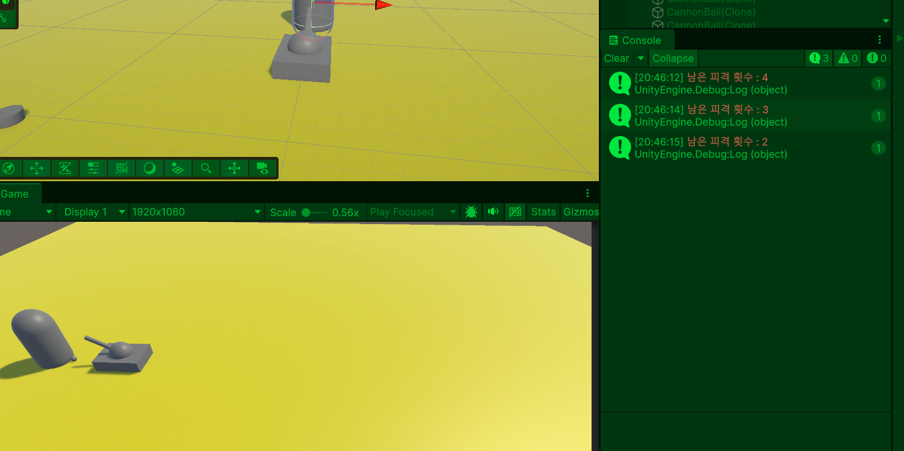

- 최종적으로 남은 피격 횟수 0이 호출되고 그 뒤에 타켓 오브젝트 비활성화

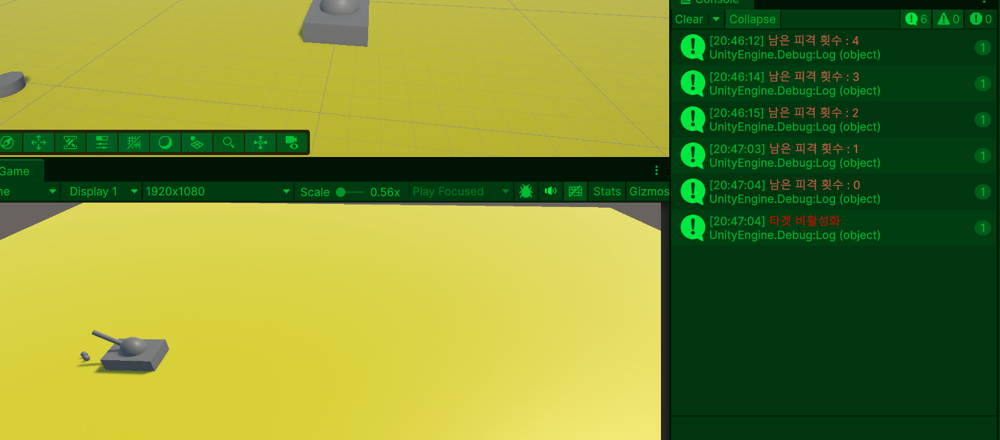

## Trigger 실습 1

- 충돌각 오브젝트에 Collider
```csharp
using UnityEngine;

// Collider 클래스: Collision과 달리 컴포넌트를 상속받고 있으며, Object 클래스도 상위 클래스로 상속,
// 매개변수에서 직접적으로 GameObject가 가진 프로퍼티를 호출 가능
public class TriggerTest : MonoBehaviour
{
    // OnTriggerEnter: 다른 Collider가 Trigger 영역 안으로 처음 들어왔을 때 1번 호출
    // 매개변수 Collider other: Trigger 영역에 들어온 상대 오브젝트의 Collider 정보가 들어옴
    private void OnTriggerEnter(Collider other)
    {
        // other는 영역에 들어온 상대 오브젝트의 Collider
        // other.tag는 other.gameObject.tag와 비슷하게 상대 오브젝트의 Tag를 가져옴
        // 상대 오브젝트의 Tag가 Player인지 검사
        if (other.tag == "Player")
        {
            // Player 태그를 가진 오브젝트가 Trigger 영역 안으로 들어오면 Console에 출력
            Debug.Log("<color=#fe6857> 플레이어가 영역 내에 들어왔다</color>");
        }
    }

    // OnTriggerStay: 다른 Collider가 Trigger 영역 안에 계속 머무는 동안 반복 호출
    private void OnTriggerStay(Collider other)
    {
        if (other.tag == "Player")
        {
            // Player가 영역 안에 있는 동안 계속 Console에 출력
            Debug.Log("<color=#fe6857> 플레이어가 영역 내에 존재한다</color>");
        }
    }

    // OnTriggerExit: 다른 Collider가 Trigger 영역 밖으로 나갔을 때 1번 호출
    private void OnTriggerExit(Collider other)
    {
            if (other.tag == "Player")
            {
                // Player가 Trigger 영역 밖으로 나가면 Console에 출력
                Debug.Log("<color=#fe6857> 플레이어가 영역에서 나갔다</color>");
            }
    }

    // 일정한 시간 간격으로 호출
    // 기본값은 보통 0.02초마다 호출
    // 주로 Rigidbody 물리 이동, 힘 추가, 물리 계산에 사용
    private void FixedUpdate()
    {
        // Time.fixedDeltaTime은 FixedUpdate 사이의 고정 시간 간격
        // 기본 설정이면 0.02초
        Debug.Log($"<color=#ad6cf3>Fixed Update 호출, 이전 호출로부터 {Time.fixedDeltaTime}</color>");
    }

    // 매 프레임마다 호출됨
    // 일반 로직 처리에 사용
    private void Update()
    {
        // Time.deltaTime은 이전 프레임과 현재 프레임 사이의 시간
        // FPS가 높으면 값이 작고, FPS가 낮으면 값이 커짐
        Debug.Log($"Update 호출, 이전 호출로부터 {Time.deltaTime}");
    }
}
```

### 결과

- 처음에 밀린 물리 계산을 따라잡기 위해 FixedUpdate()를 한 프레임 안에서 여러 번 연속 호출
- 물리 업데이트 시간이 늦어진 상태를 위해 FixedUpdate()를 여러 번 연속 호출

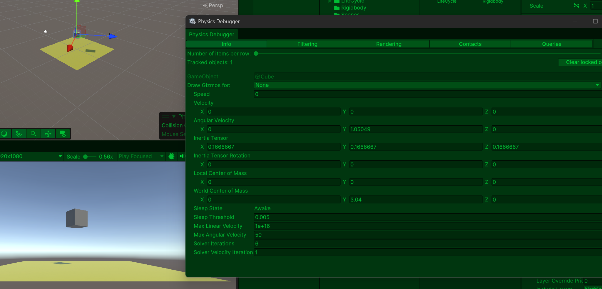

- 어느 정도 물리 계산이 안정화 되면 프레임이 안정화 되면서 FixedUpdate()가 약 0.02초 간격으로 호출

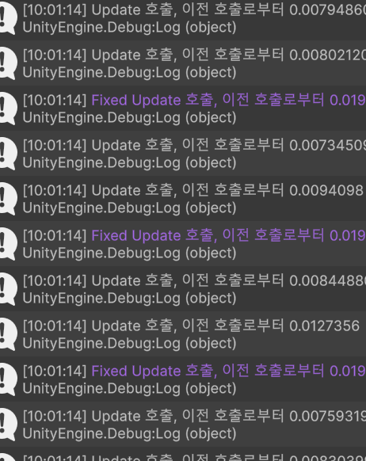

- 플레이어가 Is Trigger 체크된 적 오브젝트 Collider 범위에 들어오면 적이 감지

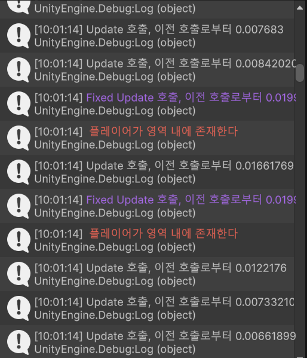

- 플레이어가 적 Collider 범위에 벗어 났을 때 

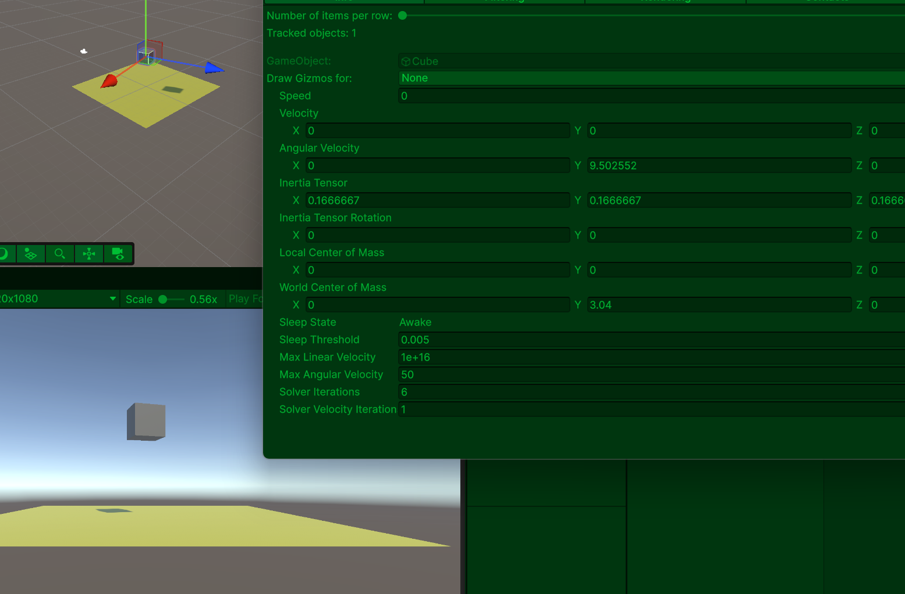

## Trigger 실습 2 : 플레이어가 마인을 밟았을 때

```csharp
using Unity.VisualScripting;
using UnityEngine;

public class MineController : MonoBehaviour
{
    // 폭발 힘의 크기
    // 값이 클수록 플레이어 Rigidbody의 속도가 커짐
    [SerializeField] private float _explosionValue;

    // 폭발까지 걸리는 시간
    // 2로 설정하면 플레이어가 지뢰 영역에 들어온 뒤 2초 후 폭발
    [SerializeField] private float _setExplosionTime;

    // 현재 남은 폭발 시간
    private float _currentExplosionTime;

    // 플레이어의 Rigidbody를 저장할 변수
    // 폭발할 때 이 Rigidbody의 속도를 변경해서 플레이어를 날림
    private Rigidbody _playerRigidbody;

    // 플레이어가 지뢰 영역 안에 있는지 확인하는 변수
    // true면 카운트다운 시작
    // false면 카운트다운 멈춤
    private bool _isDetectionPlayer;

    // 제일 먼저 초기화 함수 호출
    private void Awake()
    {
        Init();
    }

    // Trigger 영역 안으로 다른 Collider가 들어왔을 때 1번 호출
    private void OnTriggerEnter(Collider other)
    {
        // 들어온 오브젝트의 Tag가 Player인지 확인
        if (other.tag == "Player")
        {
            // 플레이어 Rigidbody를 저장하지 않았다면
            if (_playerRigidbody == null)
            {
                // Player 오브젝트에서 Rigidbody 컴포넌트를 가져와 저장
                _playerRigidbody = other.GetComponent<Rigidbody>();
            }

            // 플레이어가 지뢰 감지 범위 안에 들어왔다고 표시
            _isDetectionPlayer = true;

            // 플레이어 감지 로그 출력
            Debug.Log("<color=#fe6857>플레이어 감지!</color>");
        }
    }

    // Trigger 영역 밖으로 다른 Collider가 나갔을 때 1번 호출
    private void OnTriggerExit(Collider other)
    {
        // 나간 오브젝트의 Tag가 Player인지 확인
        if (other.tag == "Player")
        {
            // 플레이어가 나가면 카운트다운 상태를 초기화
            Init();

            // 플레이어가 범위를 벗어났다는 로그 출력
            Debug.Log("<color=#6ec6ff>플레이어가 지뢰 범위를 벗어남</color>");
        }
    }

    private void Update()
    {
        // 플레이어가 감지된 상태라면 폭발 시간 카운트다운
        TimeCount(_isDetectionPlayer);
    }

    private void Init()
    {
        // 현재 폭발 시간을 설정한 폭발 시간으로 되돌림
        _currentExplosionTime = _setExplosionTime;

        // 플레이어 감지 상태를 false로 변경
        _isDetectionPlayer = false;
    }

    // 폭발 카운트다운 함수
    // isActivate가 true일 때만 시간이 줄어듦
    private void TimeCount(bool isActivate)
    {
        // 플레이어가 감지되지 않았다면 함수 종료
        if (!isActivate)
        {
            return;
        }

        // 플레이어 Rigidbody가 없다면 함수 종료
        if (_playerRigidbody == null)
        {
            return;
        }

        // 매 프레임마다 지난 시간만큼 폭발 시간 감소
        _currentExplosionTime -= Time.deltaTime;

        // 현재 남은 폭발 시간 로그 출력
        Debug.Log($"<color=#fff36b>폭발까지 남은 시간 : {_currentExplosionTime:F2}초</color>");

        // 남은 시간이 0 이하가 되면 폭발 실행
        if (_currentExplosionTime <= 0)
        {
            Explosion();
        }
    }

    // 폭발 처리 함수
    private void Explosion()
    {
        // 폭발 로그 출력
        Debug.Log("<color=#ff0000>폭발!</color>");

        // 플레이어 Rigidbody의 속도를 랜덤 방향 * 폭발 힘으로 변경
        // 플레이어를 랜덤 방향으로 튕겨냄
        _playerRigidbody.linearVelocity = GetRandDirection() * _explosionValue;

        // 지뢰 오브젝트를 비활성화
        gameObject.SetActive(false);
    }

    // 랜덤 폭발 방향을 만드는 함수
    private Vector3 GetRandDirection()
    {
        // X: -1 ~ 1 사이 랜덤
        // Y: 1 고정, 위쪽으로 항상 뜨게 만듦
        // Z: -1 ~ 1 사이 랜덤
        // 위쪽을 항상 뜨고 좌우로 랜덤하게 튕겨내는 방향 벡터 반환
        return new Vector3(
            Random.Range(-1f, 1f),
            1,
            Random.Range(-1f, 1f)
        );
    }
}
```

### 결과

- 폭발 힘: 10, 폭발 까지 남은 카운트: 5 로 설정
- 마인이 플레이어가 범위에 있는지 감지해야 하므로 마인에만 Is Trigger 체크

- 플레이어가 마인 감지 범위에 접근 했을 때 매 프레임마다 폭발 까지 남은 시간 카운트

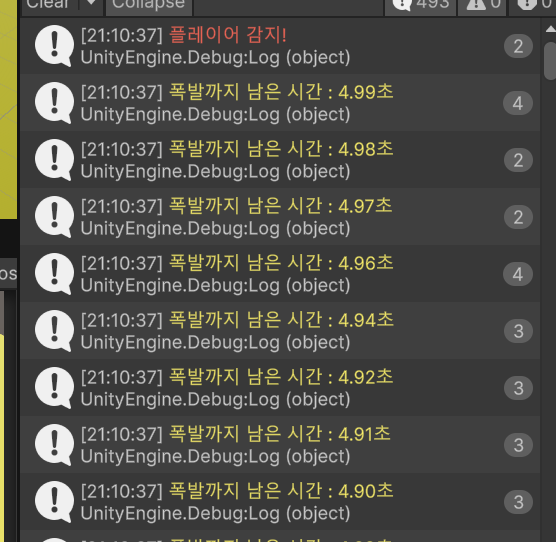

- 플레이어가 마인 감지 범위에 벗어 났을 때 폭발 까지 남은 시간 카운트 멈춤

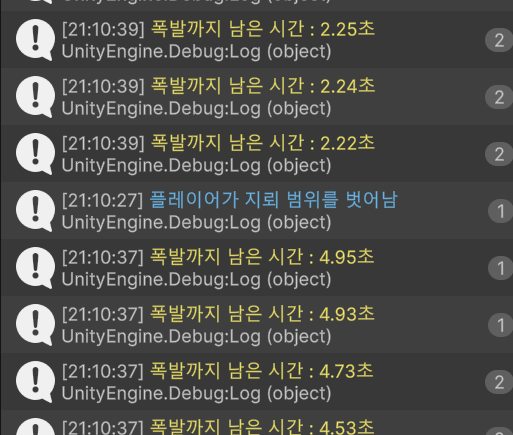

- 플레이어가 다시 마인 감지 거리에 폭발까지 시간에 머물렀을 때 폭발과 동시 y축으로 띄어오르고 x, z축 랜덤으로 이동.

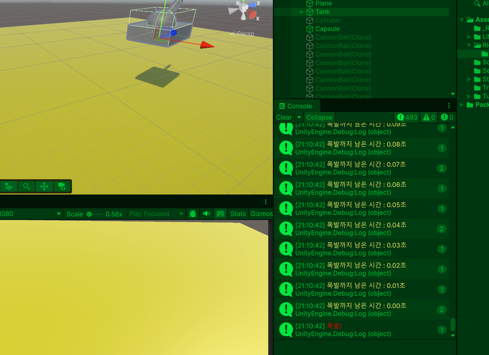

- 

- 추가적으로 둘 중에 하나라도 Is Trigger를 체크하면 무조건 통과. 체크해도 겉으로는 차이 없지만 겹침 감지가 발생, 이때 플레이어가 벽 통과, 맵 밖으로 나감, 바닥과 물리 충돌 안하고 중력에 의해 내려 앉아서 바닥 통과, OnCollisionEnter 호출 못함, 총알이 안터짐, 벽 끼임, 적 AI 뭉침, 적 AI 위치 꼬임, (상자 밀기, 폭발 반응, 공 부딪힘이 안됨) 그래서 보통 플레이어는 Is Tirgger를 체크 안함. 단, 플레이어가 Is Trigger 체크하고 충돌 처리가 아닌 Rigidbody의 속도, 힘을 이용한 스크립트로 구현하고 Use Gravity를 체크했을 때 마인 폭발 시 Rigidbody의 속도, 힘에 의해 밀려나게 됩니다. 
