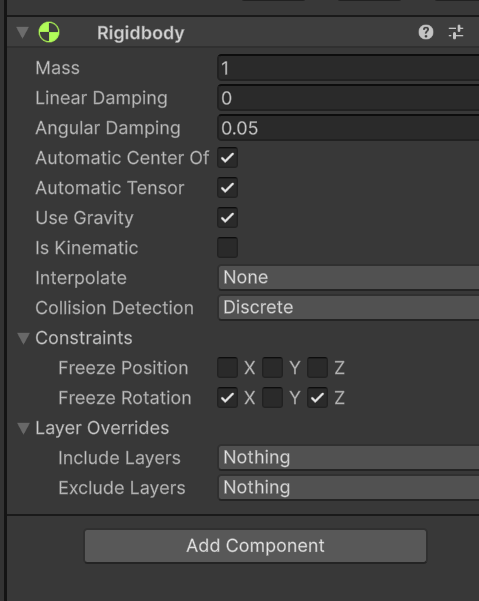
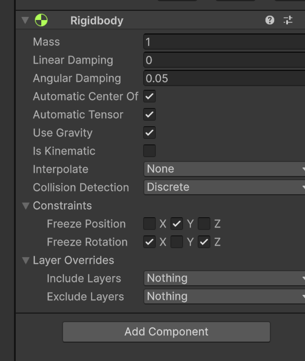
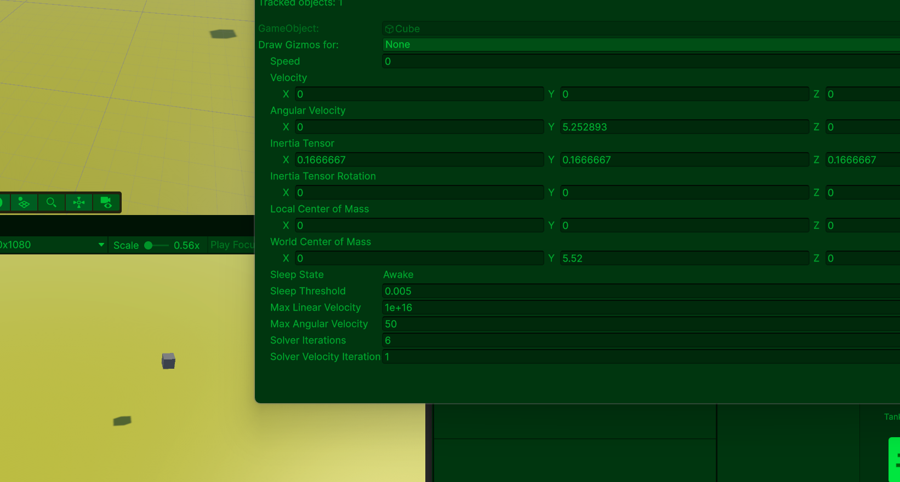
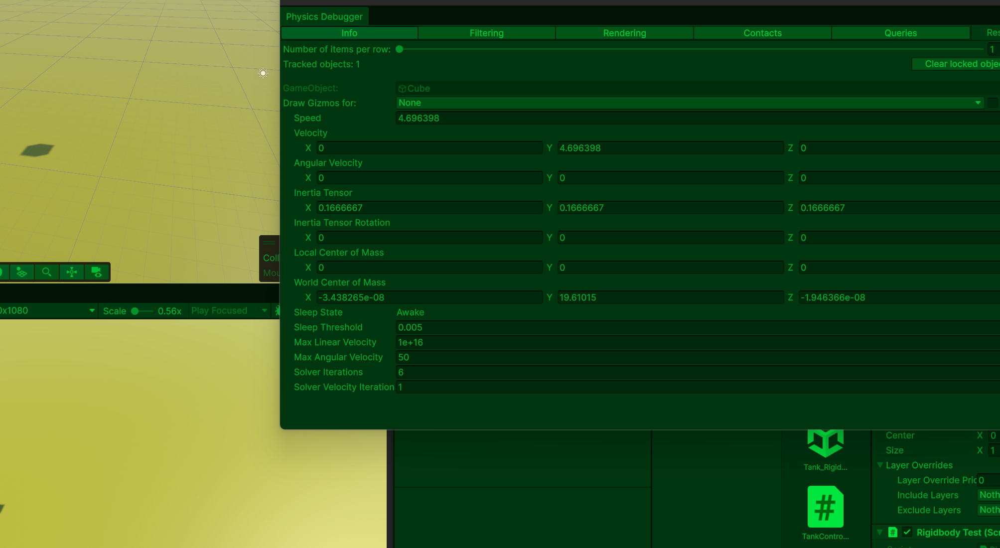
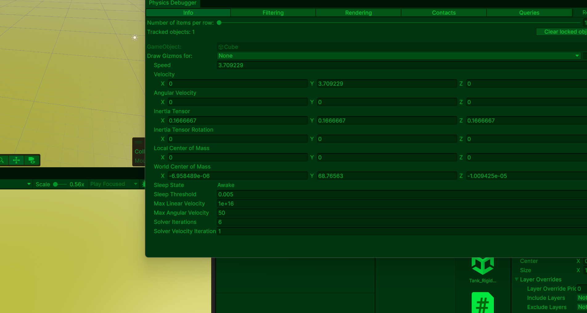
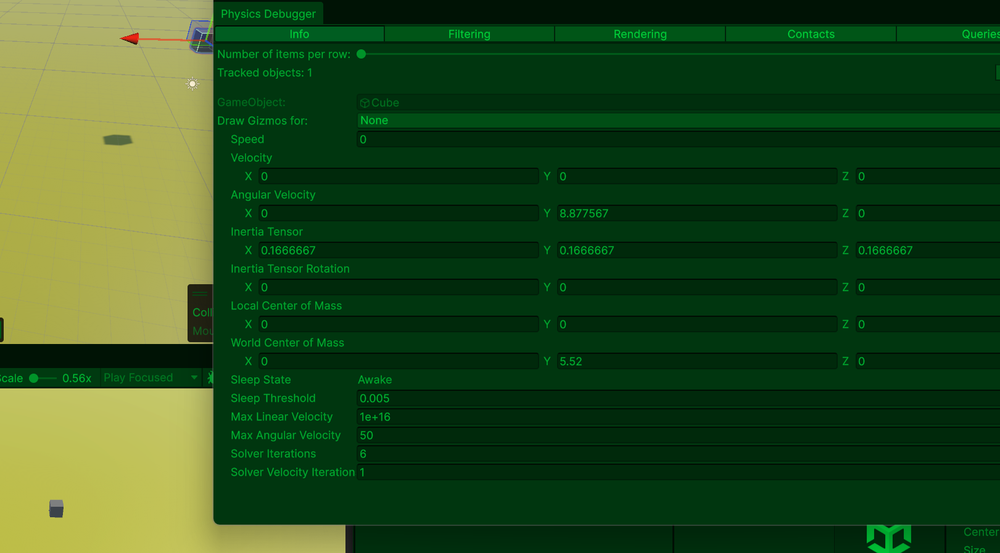
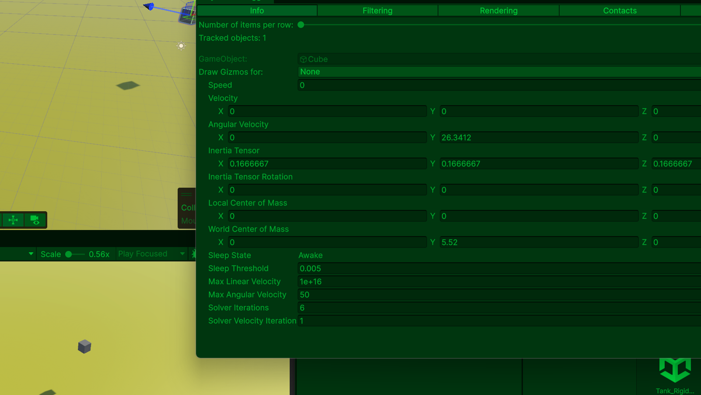
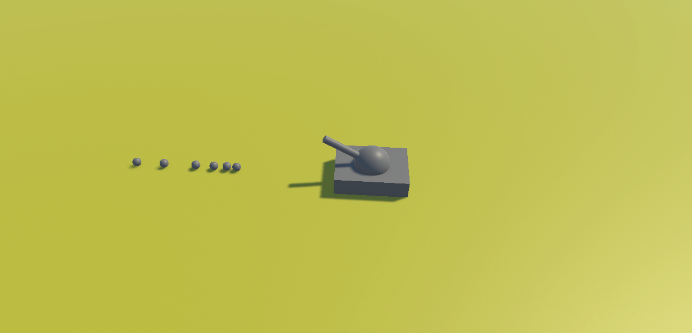
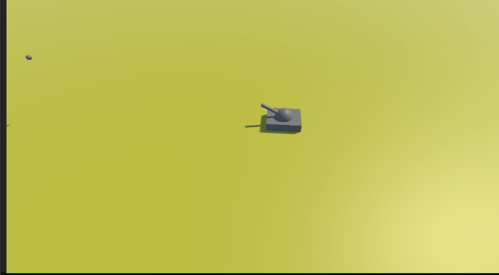

# Rigidbody

## 1-1 개념
1. 중력, 힘, 충동, 밀림 같은 물리 계산을 가능하게 하는 컴포넌트
2. Rigidbody는 고정 시간 물리 시스템으로 항상 FixedUpdate에서 호출
3. 기본적으로 클래스로 구현
4. velocityy, angularVelocity 등과 같은 프로퍼티를 호출해 제어 가능

## 1-2 특징

- Mass(질량)
1. 값이 낮을 수록 가벼움

- AddForce(x, y, z)
1. 매개변수로 입력되는 x, y, z축 방향으로 물리적인 힘을 가합니다.
2. 입력이 반복될수록 적용되는 힘이 누적

```csharp
rb.AddForce(Vector3.forward * 10f);
```

- Drag
1. 공기 저항: 속도를 점점 감소시킴
2. 값이 높을 수록 오브젝트가 빨리 멈춤

- Angular Drag
1. 회전 속도 감소

- Use Gravity
1. 중력 사용 여부
2. On체크 시 중력에 의해 오브젝트가 떨어짐

- Is Kinematic
1. 물리엔진 사용 여부
2. OFF 체크: 중력, AddForce, 충돌 반응 등 기본 물리 기능 요소를 사용, (총알 발사, 우주선 발사 등)
3. On 체크: 중력, AddForce, 충돌 반응 등 기본 물리 엔진 기능 요소를 사용안함, 물리기능을 스크립트로 구현하여 사용, (엘리베이터, 자동문, 애니메이션 물체)
    ```csharp
    transform.position
    ```
- AddTorque()
1. 매개변수로 입력되는 축의 물리적인 회전력을 더합니다.

- velocity
2. 게임 오브젝트에 가해지고 있는 물리력

- angularVelocity
3. 게임 오브젝트에 가해지고 있는 회전력

- Interpolate
1. 움직임을 부드럽게 보정, 프레임 단위의 오브젝트 보간 여부
2. Rigidbody는 FixedUpdate 기준, 카메라는 Update/LateUpdate 기준으로 움직여서 게임 씬에서 떨림이 생기기 때문에 이를 보정을 위해 사용

- Collision Detection
1. 충돌 갑지 방식
2. Discrete: 기본 충돌, 빠른 물체 관통 가능
3. Continuous: 고속 충돌 감지

- Constraints
1. 위치 혹은 회전 설정
2. Freeze Position: 위치 이동 제한
3. Freeze Rotation: 회전 제한

- Rigidbody와 Collider 관계
1. Rigidbody만 있으면 충돌 계산 부족

## 1-3 Rigidbody 대표적 함수 종류

- AddForce
1. 힘 적용

```csharp
rb.AddForce(Vector3.forward * 10f);
```

- velocity
1. 속도 직접 설정

```csharp
rb.velocity = Vector3.forward * 5f;
```

- AddTorque
1. 회전 힘 적용

```csharp
rb.AddTorque(Vector3.up * 10f);
```


- MovePosition
1. 물리 기반 이동

```csharp
rb.MovePosition(...)
```

## 1-4 Rigidbody 실습

### a. 미는 힘

```csharp
using System.Xml.Serialization;
using UnityEngine;
using UnityEngine.InputSystem;

public class RigidbodyTest : MonoBehaviour
{
    private Rigidbody _rigidbody;
    [SerializeField] private float _force;
    [SerializeField] private float _velocityValue;

    private void Awake()
    {
        Init();
    }

    // 초기화 함수를 생성하고 Rigidbody 컴포넌트를 가져오는 코드
    // 라이프사이클 기본 함수가 아닌 직접 호출하는 방식
    // 외부 데이터 세팅
    // 필요한 값을 세팅하는 것으로 플레이어 HP, 속도, 공격력 등 초기화
    private void Init()
    {
        _rigidbody = GetComponent<Rigidbody>();
    }

    private void Update()
    {
        if(Input.GetKeyDown(KeyCode.S))
        {
            // 위로 힘을 부여, Force값을 높이면 가속도가 증가하여 순간 속도가 증가
            _rigidbody.AddForce(Vector3.up * _force, ForceMode.Impulse);
        }

        // 구버전에서 velocity로 표현하지만 최신버전에서는 linearVelocity로 표현
        if (Input.GetKeyDown(KeyCode.Z))
        {
            _rigidbody.linearVelocity = Vector3.zero;
            _rigidbody.angularVelocity = Vector3.zero;
        }
    }
}
```

### 결과: S를 누르면 오브젝트가 위로 힘을 가하고 Z를 눌렀을 Rigidbody의 이동 속도 초기화, Velocity Value 값 설정X, Force값 설정으로 가속도 조절 Force 값이 높으면 가속도를 높아져 순간 위로 띄게 됩니다. Z를 누르면 중력 속도가 초기화 되어 원점으로 돌아갑니다. 





### b. 회전력 실습, velocity값 설정 불가

```csharp
using System.Xml.Serialization;
using UnityEngine;
using UnityEngine.InputSystem;

public class RigidbodyTest : MonoBehaviour
{
    private Rigidbody _rigidbody;
    [SerializeField] private float _force;
    [SerializeField] private float _velocityValue;

    private void Awake()
    {
        Init();
    }

    private void Init()
    {
        _rigidbody = GetComponent<Rigidbody>();
    }

    private void Update()
    {
        if(Input.GetKeyDown(KeyCode.S))
        {
            // 회전력
            _rigidbody.AddTorque(Vector3.up * _force);
        }

        if (Input.GetKeyDown(KeyCode.Z))
        {
            _rigidbody.linearVelocity = Vector3.zero;
            _rigidbody.angularVelocity = Vector3.zero;
        }
    }
}
```

### 결과: S를 누르고 있으면 Angular Velocity의 Y값이 증가하고 Z를 누르면 회전값 초기화




### c. 이동 속도, velocity value 값 설정 가능 시

```csharp
using System.Xml.Serialization;
using UnityEngine;
using UnityEngine.InputSystem;

public class RigidbodyTest : MonoBehaviour
{
    private Rigidbody _rigidbody;
    [SerializeField] private float _force;
    [SerializeField] private float _velocityValue;

    private void Awake()
    {
        Init();
    }

    private void Init()
    {
        _rigidbody = GetComponent<Rigidbody>();
    }

    private void Update()
    {
        if(Input.GetKeyDown(KeyCode.S))
        {
            // 이동 속도 값
            _rigidbody.linearVelocity = Vector3.up * _velocityValue;
        }

        // 구버전에서 velocity로 표현하지만 최신버전에서는 linearVelocity로 표현
        if (Input.GetKeyDown(KeyCode.Z))
        {
            _rigidbody.linearVelocity = Vector3.zero;
            _rigidbody.angularVelocity = Vector3.zero;
        }
    }
}
```
### 결과

- 이동 속도: 20 일 때


- 이동 속도: 30 일 때


- velocity value가 높을 수록 이동 속도가 높아져 Y(위로) 값이 증가하여 더 높게 띄게된다.

### d. 회전력 실습, velocity값 설정 시 회전력

```csharp
using System.Xml.Serialization;
using UnityEngine;
using UnityEngine.InputSystem;

public class RigidbodyTest : MonoBehaviour
{
    private Rigidbody _rigidbody;
    [SerializeField] private float _force;
    [SerializeField] private float _velocityValue;

    private void Awake()
    {
        Init();
    }

    private void Init()
    {
        _rigidbody = GetComponent<Rigidbody>();
    }

    private void Update()
    {
        if(Input.GetKeyDown(KeyCode.S))
        {
            // angularVelocity value 값 설정 시 회전력
            _rigidbody.angularVelocity = Vector3.up * _velocityValue;
        }

        // 구버전에서 velocity로 표현하지만 최신버전에서는 linearVelocity로 표현
        if (Input.GetKeyDown(KeyCode.Z))
        {
            _rigidbody.linearVelocity = Vector3.zero;
            _rigidbody.angularVelocity = Vector3.zero;
        }
    }
}
```

### 결과

- Velocity Value 값 10일 때 S를 눌러서 회전력 부여시 Angular Velocity Y 값이 8 ~ 9 사이 유지


- Velocity Value 값 30일 때 S를 눌러서 회전력 부여시 Angular Velocity Y 값이 29 ~ 27 사이 유지


### e. Tank를 만들어서 Rigidbody 실습

- x축과 y축 회전이 필요 없으므로 체크하고 위치도 y축이 움직일 필요 없으므로 고정해줍니다.


```csharp
using System.Collections;
using System.Collections.Generic;
using UnityEngine;

// 탱크 이동 + 회전 + 포탄 발사 기능
public class TankController : MonoBehaviour
{
    // 탱크 이동 속도
    [SerializeField] private float _moveSpeed;

    // 탱크 회전 속도
    [SerializeField] private float _rotateSpeed;

    // 물리 기반 이동에 사용
    private Rigidbody _rigidbody;

    // 포탄 발사 위치(총구)
    [SerializeField] private Transform _muzzleTransform;

    // 생성할 포탄 프리팹
    [SerializeField] private GameObject _cannonBallPrefab;

    // 미리 생성할 포탄 개수
    // 오브젝트 풀링에 사용
    [SerializeField] private int _cannonBallPoolSize;

    // 생성된 포탄 저장 배열
    private GameObject[] _cannonBallPool;

    private void Awake()
    {
        // 초기화
        Init();
    }

    private void Update()
    {
        // 매 프레임 이동 처리
        ObjectMoving();

        // Space 키를 누르면 포탄 발사
        if (Input.GetKeyDown(KeyCode.Space))
        {
            CannonShot();
        }
    }

    private void Init()
    {
        // 현재 오브젝트에 붙어있는 Rigidbody 가져오기
        _rigidbody = GetComponent<Rigidbody>();

        // 오브젝트 풀 배열 생성
        _cannonBallPool = new GameObject[_cannonBallPoolSize];


        // 오브젝트 풀링(Object Pooling)
        // 포탄을 미리 생성해두고, 발사 시 재사용
        // 특징:
        // - Instantiate 반복 감소
        // - Destroy 반복 감소
        // - 성능 향상
        // - 가비지 컬렉션 감소

        for (int i = 0; i < _cannonBallPool.Length; i++)
        {
            // 포탄 프리팹 생성
            _cannonBallPool[i] = Instantiate(_cannonBallPrefab);

            // 처음에는 비활성화
            _cannonBallPool[i].SetActive(false);
        }
    }

    // 이동처리 함수
    private void ObjectMoving()
    {
        // 입력 방향 계산
        Vector3 direction = GetNormalizedDirection();

        // 입력이 없으면 함수 종료
        if (direction == Vector3.zero)
        {
            return;
        }

        // 방향 회전 처리
        SetRotateLerp(direction);

        // 앞으로 이동
        SetForwardVelocity(_moveSpeed);
    }

    // 회전 처리 함수
    private void SetRotateLerp(Vector3 direction)
    {
        // Quaternion
        // 오브젝트 회전 처리 구조체

        // Quaternion.LookRotation(direction)
        // direction 방향을 바라보는 회전값 생성

        // Quaternion.Lerp
        // 현재 회전값 -> 목표 회전값
        // 부드럽게 보간

        transform.rotation = Quaternion.Lerp(
            transform.rotation,
            Quaternion.LookRotation(direction),
            _rotateSpeed * Time.deltaTime
        );

    }


    // 이동 속도 함수
    private void SetForwardVelocity(float value)
    {
        // transform.forward
        // 현재 오브젝트의 앞 방향

        // linearVelocity
        // Rigidbody 이동 속도 설정

        // 현재 바라보는 방향으로 이동
        _rigidbody.linearVelocity = transform.forward * value;
    }


    // 입력 방향 계산 함수
    private Vector3 GetNormalizedDirection()
    {
        // 방향 벡터 초기화
        Vector3 inputDirection = Vector3.zero;

        // 좌우 입력
        // A / D
        inputDirection.x = Input.GetAxisRaw("Horizontal");

        // 앞뒤 입력
        // W / S
        inputDirection.y = Input.GetAxisRaw("Vertical");


        // normalized
        // 벡터 길이를 1로 정규화
        // 대각선 이동 속도 보정
        return inputDirection.normalized;
    }


    // 포탄 발사 함수
    private void CannonShot()
    {
        // 오브젝트 풀에 저장된 포탄 검사
        foreach (var ball in _cannonBallPool)
        {
            // 비활성화된 포탄 찾기
            if (!ball.activeSelf)
            {
                // 총구 위치로 이동
                ball.transform.position = _muzzleTransform.position;

                // 총구 방향 회전
                // 현재는 up 방향 기준
                ball.transform.rotation = Quaternion.LookRotation(_muzzleTransform.up);

                // 포탄 활성화
                ball.SetActive(true);

                // 하나 발사 후 종료
                return;
            }
        }
    }
}
```

```csharp
using UnityEngine;

// 포탄 이동 및 비활성화 처리
public class CannonBallController : MonoBehaviour
{
    // 포탄 비활성화 시간
    // 포탄이 몇 초 후 사라질지 설정
    [SerializeField] private float _deactivateTime;


    // 포탄 발사 힘
    // Rigidbody에 가할 힘의 크기
    // 값이 클수록:
    // 더 빠르게 날아감
    // 더 멀리 이동
    [SerializeField] private float _shotForce;

    // Rigidbody 저장 변수
    // 물리 이동 처리용
    private Rigidbody _rigidbody;


    // 비활성화 카운트 변수
    // 남은 시간을 저장
    private float _deactCount;

    private void Awake()
    {
        // 게임 시작 시 초기화
        Init();
    }

    private void OnEnable()
    {
        // 오브젝트 활성화 시 실행
        // SetActive(true) 될 때마다 호출
        ActivateAction();
    }

    private void Update()
    {
        // 매 프레임 시간 감소 처리
        TimeCount();
    }


    // 초기화 함수
    private void Init()
    {
        // 현재 오브젝트의 Rigidbody 가져오기
        _rigidbody = GetComponent<Rigidbody>();
    }

    // 시간 감소 함수
    private void TimeCount()
    {
        // Time.deltaTime
        // 한 프레임에 걸린 시간
        // 초 단위 감소 처리 가능
        _deactCount -= Time.deltaTime;


        // 남은 시간이 0 이하라면
        if (_deactCount <= 0)
        {
            // 오브젝트 비활성화
            // Destroy 대신 비활성화 사용
            // 오브젝트 풀링 재사용 가능
            gameObject.SetActive(false);
        }
    }

    // 활성화 시 실행 함수
    private void ActivateAction()
    {
        // 비활성화 카운트 초기화
        // _deactivateTime = 3
        //
        // 활성화 시:
        // _deactCount = 3
        _deactCount = _deactivateTime;

        // Rigidbody.AddForce
        // 물리 힘 적용 함수
        // transform.forward 방향으로 힘 적용
        // 현재 포탄이 바라보는 방향으로 발사
        _rigidbody.AddForce(
            transform.forward * _shotForce,
            ForceMode.Impulse
        );

        // ForceMode.Impulse
        // 순간적인 충격 힘 적용
    }
}
```

### 결과

- 투사체 오브젝트는 기본적인 물리 엔진 기능을 사용해야 하므로 Is Kinematic 체크
- Deactivate Time: 값이 높으면 포탄이 사라지는 시간 증가
- Shot Force: 포탄이 날아가는데 힘으로 값이 클수록 순간 멀리 나갑니다.
- Cannon Ball PoolSize: 포탄을 연속으로 쏠수있는 것을 설정하여 갯수 제한.



