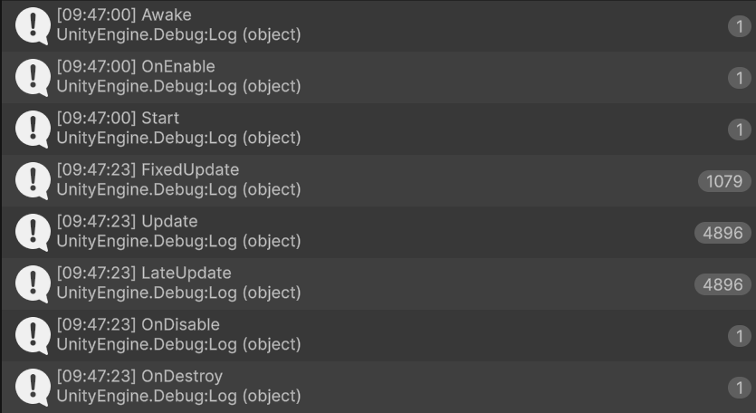

1. 실습 코드 작성
'''csharp
using System;
using UnityEngine;

public class test : MonoBehaviour
{
    public void Awake()
    {
        Debug.Log("Awake");
    }

    public void OnEnable()
    {
        Debug.Log("OnEnable");
    }

    public void Start()
    {
        Debug.Log("Start");
    }

    public void FixedUpdate()
    {
        Debug.Log("FixedUpdate");
    }

    public void Update()
    {
        Debug.Log("Update");
    }

    public void LateUpdate()
    {
        Debug.Log("LateUpdate");
    }

    public void OnDisable()
    {
        Debug.Log("OnDisable");
    }

    public void OnDestroy()
    {
        Debug.Log("OnDestroy");
    }

}
'''

2. 응용 가능한 목록 작성

Awake(): 씬이 시작할 때(오브젝트마다 한 번) 호출
 - start() 함수 전에 호출
 - 프리팹이 인스턴스화 된 직후에 호출
 - 오브젝트가 비활성화 상태인 경우 활성화 될 때까지 호출되지 않음

OnEnable() : 오브젝트가 활성화된 경우에만 호출
 - 오브젝트 활성화 직후 호출

Start(): 첫 번째 프레임 업데이트 전에
 - Script 인스턴스가 활성화 된 경우에만 호출
 - 오브젝트가 게임플레이 도중 인스턴스화 될 때 실행되지 않음

FixedUpdate(): 프레임 속도에 따라 호출 빈도가 다름
 - 모든 물리계산 및 업데이트는 FixedUpdate 이후 즉시 발생함
 - 움직임 계산 적용 시 Time.DeltaTime만큼 곱할 필요 X
 - 프레임 속도와 관계없이 신뢰할 수 있는 타이머에서 호출되기 때문

Update(): 프레임당 한 번 호출
- 프레임 업데이트를 위한 주요 작업 함수

LateUpdate(): Update가 끝난 후 프레임당 한 번 호출
 - 일반적을 3인칭 카메라에 사용 -> 캐릭터를 움직이고 Update로 방향을 바꾸게 되는 경우

OnDisable(): 오브젝트 마지막 프레임에 대해 모든 프레임 업데이트를 마친 후 이 함수가 호출
- 오브젝트 파괴 시에 사용

OnDestroy(): 씬의 활성화된 모든 오브젝트에서 호출
- 동작이 비활성화되거나 비활성 상태일 때 호출됨

3. 구현 순서 풀어보기 (흐름도 작성)
Awake()
OnEnable()
(첫 번째 씬로드)
Start()
(첫 번째 프레임 업데이트 전에)
-----------Initialization
FixedUpdate()
-----------Physics
Update()
LateUpdate()
-----------Game logic
OnDisable()
OnDestroy()
-----------Decommissioning

4. 추가 공부 필요한 목록
- OnTrigger
- OnCollision
- OnMouse
- OnDrawGizmos
- OnGUI
- yield WaitForFixedUpdate 와 코루틴 그리고 Update와의 순서