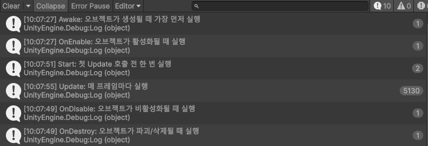

### UnityLifecycle

1. 구현 해야할 기능에 대한 공부
   
   - 자주 쓰는 유니티 생명주기 이벤트 함수 조사
   - 
     - Awake
       - Start 함수 전에 호출되며 오브젝트가 생성될 때 가장 먼저 실행
     - OnEnable
       - 오브젝트가 활성화 될 때 실행
     - Start
       - 첫 Update 호출 전 한 번 실행
     - Update
       - 프레임당 한 번 호출. 프레임 업데이트를 위한 주요 작업 함수
     - OnDisable
       - 오브젝트가 비활성화되거나 비활성 상태일때 실행
     - OnDestroy
       - 오브젝트가 파괴/삭제될 때 실행
     ---
```
using UnityEngine;

public class Sporner : MonoBehaviour
{
    public void Awake()
    {
        Debug.Log("Awake: 오브젝트가 생성될 때 가장 먼저 실행");
    }

    public void OnEnable()
    {
        Debug.Log("OnEnable: 오브젝트가 활성화될 때 실행");
    }

    public void Start()
    {
        Instantiate(tri);
        Debug.Log("Start: 첫 Update 호출 전 한 번 실행");
    }
    public GameObject tri;


    public void Update()
    {
        Debug.Log("Update: 매 프레임마다 실행");
    }


    public void OnDisable()
    {
        Debug.Log("OnDisable: 오브젝트가 비활성화될 때 실행");
    }

    public void OnDestroy()
    {
        Debug.Log("OnDestroy: 오브젝트가 파괴/삭제될 때 실행"); 
    }


}
```
   

   - 모르는 개념 기록해두기
     - .
     - 
 
   - 뭘 실수했는지 기록해두기
     1. Start뒤에 OnEnable을 적었었다. 라이프사이클 순서로는 Start보다 OnEnable이 먼저 작동해야한다.

   - 해결 했을 시 해결 방법 기록.
     1. (실수 1번) OnEnable의 위치를 Start보다 앞쪽에 배치했다.
     2. 